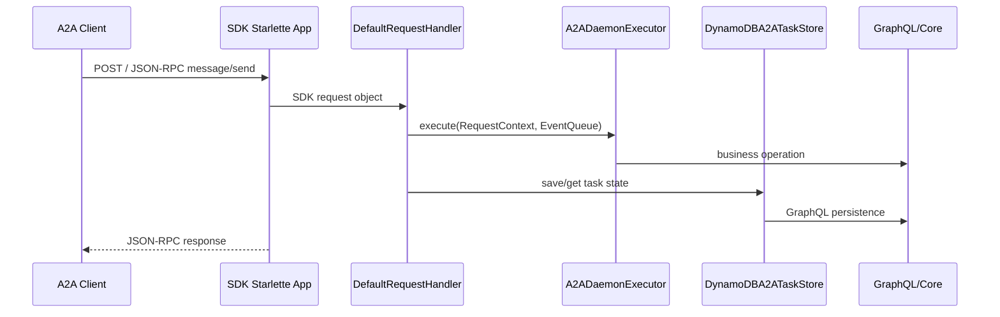

# A2A Architecture

The daemon exposes the A2A protocol through the official SDK Starlette
application at the HTTP root. The mounted FastAPI application under `/rest` is
an operations surface only; it is not an alternate A2A protocol binding.

## HTTP Surface

| Path | Owner | Purpose |
| --- | --- | --- |
| `GET /.well-known/agent-card.json` | A2A SDK app | Public Agent Card discovery |
| `POST /` | A2A SDK app (compatibility endpoint) | JSON-RPC with slash-style methods (`message/send`, `tasks/get`, `tasks/cancel`) |
| `POST /v1` | A2A SDK app (native dispatcher) | JSON-RPC with native v1 methods (`SendMessage`, `GetTask`, `CancelTask`); `enable_v0_3_compat=True` |
| `GET /tasks/{task_id}/stream` | SDK app + SSE manager | Task event stream and replay |
| `GET /rest/health` | FastAPI operations app | Health check |
| `GET /rest/me` | FastAPI operations app | Authenticated user claims |
| `GET /rest/{endpoint_id}` | FastAPI operations app | Operational endpoint metadata |
| `POST /rest/{endpoint_id}/a2a_core_graphql` | FastAPI operations app | GraphQL access to daemon data |

Removed surfaces:

- `/rest/a2a-jsonrpc`
- `/rest/a2a/{endpoint_id}/...` protocol-style REST routes
- `handlers/a2a_jsonrpc.py`
- direct `action=register_agent`, `action=assign_task`, and `action=route_message`
  dispatch through `A2ADaemonEngine.a2a()`

## Runtime Components

| Component | File | Responsibility |
| --- | --- | --- |
| Process/runtime entry | `a2a_daemon_engine/main.py` | Initializes `Config`, selects HTTP/gRPC transport, mounts the SDK app as primary, and mounts the operations app at `/rest`. |
| SDK server and Agent Card | `handlers/a2a_server.py` | Builds the v1 Agent Card, SDK `DefaultRequestHandler`, executor, task store, JSON-RPC routes, and SSE routes. |
| A2A execution | `handlers/a2a_executor.py` | Implements the SDK `AgentExecutor` contract and routes protocol operations into daemon business handlers. |
| Task store | `handlers/a2a_taskstore.py` | Implements the SDK `TaskStore` contract using GraphQL/DynamoDB persistence and v1 task-state names. |
| JSON-RPC bridge | `handlers/a2a_jsonrpc_bridge.py` | Converts serverless JSON-RPC dictionaries into SDK request objects for `A2ADaemonEngine.a2a()`. |
| Operations app | `handlers/a2a_app.py` | Provides health, identity, endpoint info, and GraphQL routes under `/rest`. |
| Business handlers | `handlers/a2a_handlers.py` | Implements domain operations against `Config.a2a_core`; these are invoked by SDK execution paths, not exposed as alternate protocol routes. |
| Experimental gRPC | `handlers/a2a_grpc.py` | Provides JSON-over-gRPC adapter handlers for advanced transport experiments. |

## Request Flow

## Serverless Flow

`A2ADaemonEngine.a2a(**event)` accepts JSON-RPC 2.0 payloads only. It builds SDK
request objects through `a2a_jsonrpc_bridge.py` and dispatches to the same SDK
request handler methods used by the HTTP protocol path.

Non-JSON-RPC action payloads are rejected.
