# A2A Daemon Engine Architecture

**Status:** Working architecture reference for the current implementation.
**Scope:** A2A HTTP JSON-RPC, SDK execution flow, SSE streaming, task store, push configuration helpers, extended agent cards, and experimental gRPC.

This document describes how A2A protocol traffic moves through this repository. It is intentionally implementation-facing: diagrams name the modules that currently receive, route, persist, stream, or adapt each call.

---

## 1. Runtime Shape

The daemon runs the A2A SDK Starlette app as the primary HTTP application. REST routes are mounted under `/rest` for compatibility and operational clients.

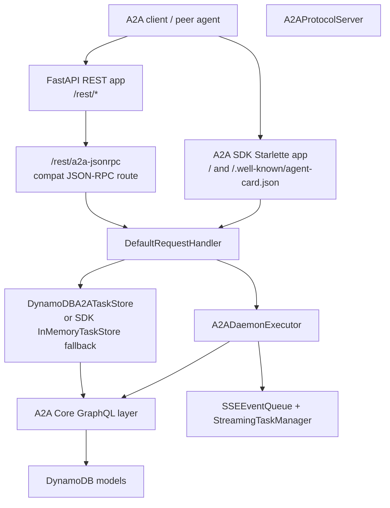

Primary modules:

| Concern | Module | Detailed Description |
|---|---|---|
| Process/runtime entry | `a2a_daemon_engine/main.py` | Builds daemon settings, initializes `Config`, selects the active transport (`http`, `lambda`, or experimental `grpc`), mounts the SDK app as the primary HTTP surface, and preserves the serverless-style `a2a()` action/JSON-RPC invocation path. |
| SDK server and Agent Card | `handlers/a2a_server.py` | Creates the A2A `AgentCard`, declares skills/capabilities, builds the SDK `DefaultRequestHandler`, wires the canonical executor and task store, registers SSE routes, and exposes compatibility methods for agent registration, task assignment, message routing, and discovery. |
| A2A execution | `handlers/a2a_executor.py` | Implements the SDK `AgentExecutor` contract. It adapts SDK `RequestContext` objects into internal operations, emits task status/message events, routes task/message/agent operations to business handlers, and handles task cancellation with SDK-version compatibility helpers. |
| Persistent task store adapter | `handlers/a2a_taskstore.py` | Bridges the A2A SDK task-store interface to the daemon's DynamoDB/GraphQL task model, including task get/save/list behavior, task-state normalization, cursor pagination, and replay-buffer alignment for streaming. |
| SSE streaming and replay | `handlers/a2a_sse.py` | Provides `SSEEvent`, per-task replay buffers, subscriber queues, `Last-Event-ID` reconnect support, task status/artifact emitters, and the `/tasks/{task_id}/stream` `text/event-stream` endpoint registration. |
| REST and compatibility JSON-RPC routes | `handlers/a2a_app.py`, `handlers/a2a_jsonrpc.py` | Hosts auxiliary FastAPI routes under `/rest`, authentication-aware REST endpoints, and the compatibility JSON-RPC route. The current `/rest/a2a-jsonrpc` path delegates selected protocol methods to the SDK handler; `a2a_jsonrpc.py` remains a deprecated compatibility shim. |
| Business compatibility handlers | `handlers/a2a_handlers.py` | Contains domain-level operations for agent handshake, task assignment, message routing, state sync, agent discovery, and message delivery retries. These handlers bridge REST/serverless requests and executor operations into GraphQL persistence. |
| Push config helpers | `handlers/a2a_pushconfig.py` | Implements A2A-style task push-notification configuration management, including create/get/list/delete behavior, webhook URL validation, private-network/SSRF protections, allowlist checks, and notification delivery helpers. |
| Extended card helpers | `handlers/a2a_extended_card.py` | Builds authenticated extended Agent Card responses with richer operational metadata such as rate limits, security policy, traceability extension data, cache headers, ETag handling, and conditional request support. |
| Experimental gRPC | `handlers/a2a_grpc.py` | Provides the Phase 9 JSON-over-gRPC adapter with unary and streaming handlers for send/get/list/cancel/subscribe operations. It adapts dict payloads into executor-compatible request contexts and should be replaced with generated protobuf stubs before production use. |

---

## 2. Endpoint Map

| Endpoint / Transport | Purpose | Current Status |
|---|---|---|
| `GET /.well-known/agent-card.json` | Public Agent Card discovery | SDK app exposes this |
| `POST /` | Native A2A SDK JSON-RPC endpoint | Primary protocol path |
| `POST /rest/a2a-jsonrpc` | Compatibility JSON-RPC route | Routes selected methods to SDK handler |
| `GET /tasks/{task_id}/stream` | SSE task update stream | Registered on the A2A SDK app |
| `/rest/a2a/{endpoint_id}/...` | REST compatibility/admin routes | Auxiliary |
| `grpc://host:port/a2a.A2AService/*` | JSON-over-gRPC experimental transport | Implemented as Phase 9 experimental |

---

## 3. Cross-Cutting Request Flow

Most protocol methods follow this pattern:

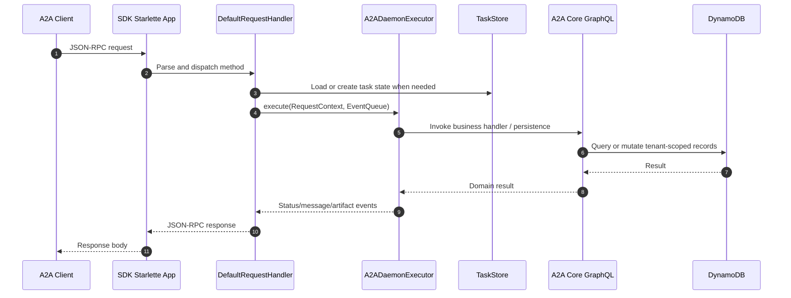

Tenant isolation is carried by `partition_key`, usually assembled from `endpoint_id#part_id` or passed through headers such as `Part-ID` / `X-Partition-Key` on compatibility routes.

---

## 4. Agent Card Discovery

### 4.1 `GET /.well-known/agent-card.json`

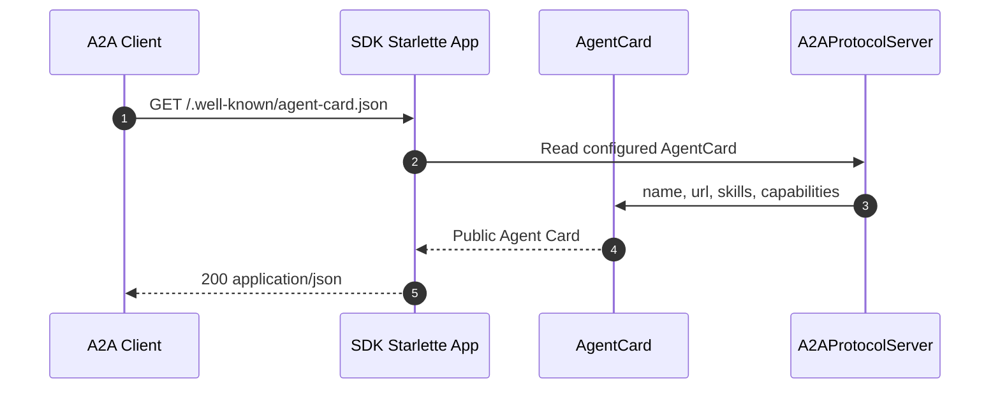

The card is created in `A2AProtocolServer._create_agent_card()`. It advertises streaming and push-notification capability.

### 4.2 Authenticated Extended Agent Card

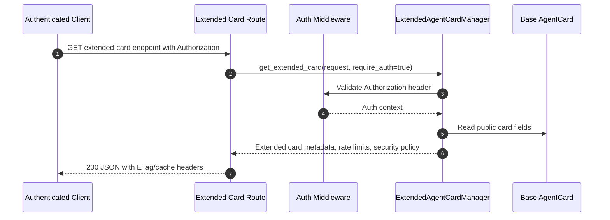

Extended card support exists as a Phase 8 helper. Its route wiring should be verified in the selected deployment mode before release certification.

---

## 5. Message Send

### 5.1 JSON-RPC `message/send`

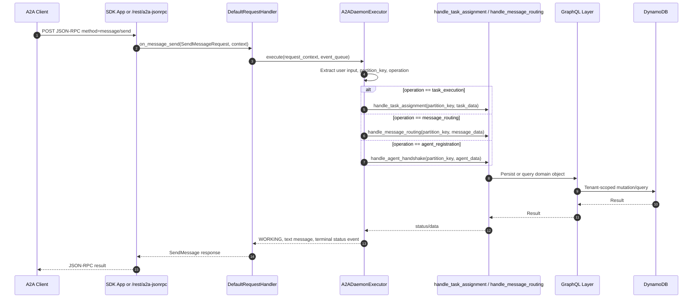

The executor accepts multiple internal operations because this daemon bridges A2A SDK messages to existing SilvaEngine handlers.

---

## 6. Streaming Message / SSE

### 6.1 Send Streaming Message

Streaming is represented by SDK streaming plus the repo's SSE helper. The current concrete SSE endpoint is `/tasks/{task_id}/stream`; `StreamingTaskManager` emits task status and artifact events into `SSEEventQueue`.

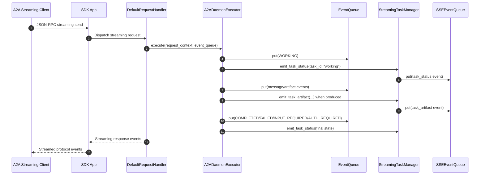

### 6.2 Subscribe To Task via SSE

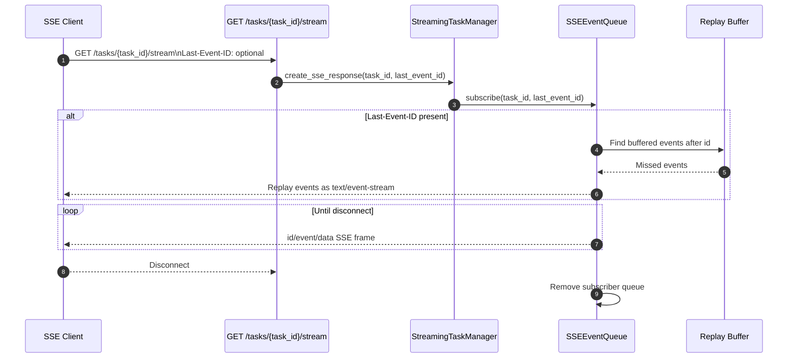

SSE frames use:

```text
id: evt-...
event: task_status
data: {"task_id":"...","state":"working"}
```

---

## 7. Task Query

### 7.1 JSON-RPC `tasks/get`

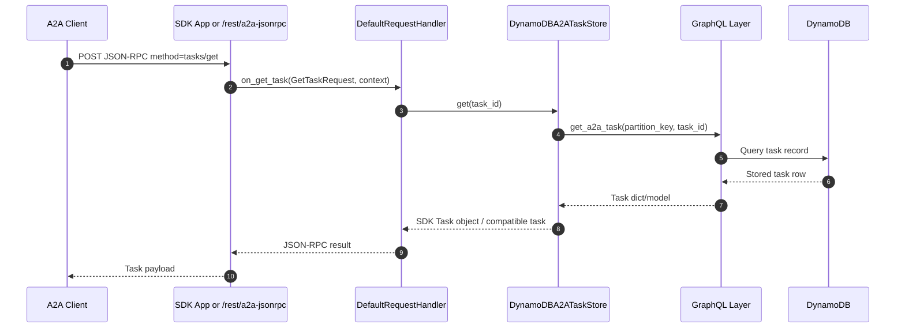

### 7.2 Task List

The SDK request handler can use the task store listing contract when list support is exposed by the selected SDK route. The project task store implements cursor pagination.

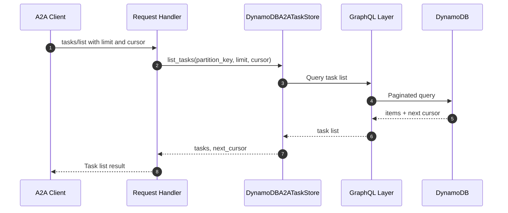

---

## 8. Task Cancellation

### 8.1 JSON-RPC `tasks/cancel`

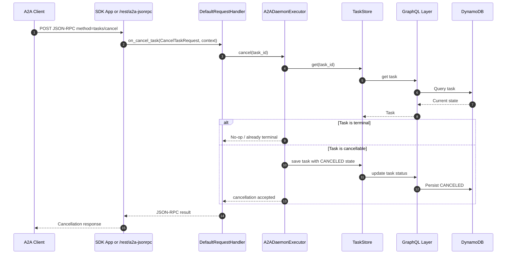

### 8.2 Delegated Cancellation Propagation

Phase 9 adds `CancellationPropagator` for parent/child cancellation chains.

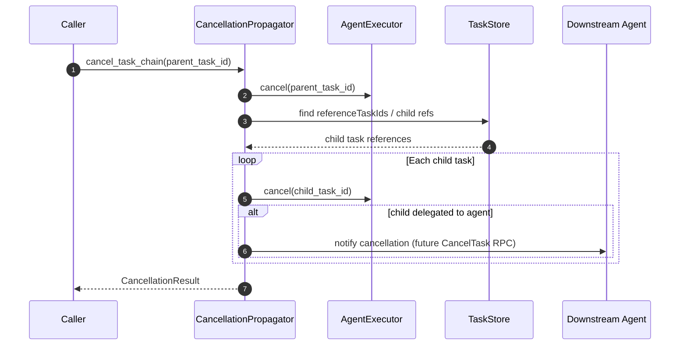

---

## 9. Multi-Turn States

`INPUT_REQUIRED` and `AUTH_REQUIRED` are emitted through streaming helpers when a task needs user input or authentication.

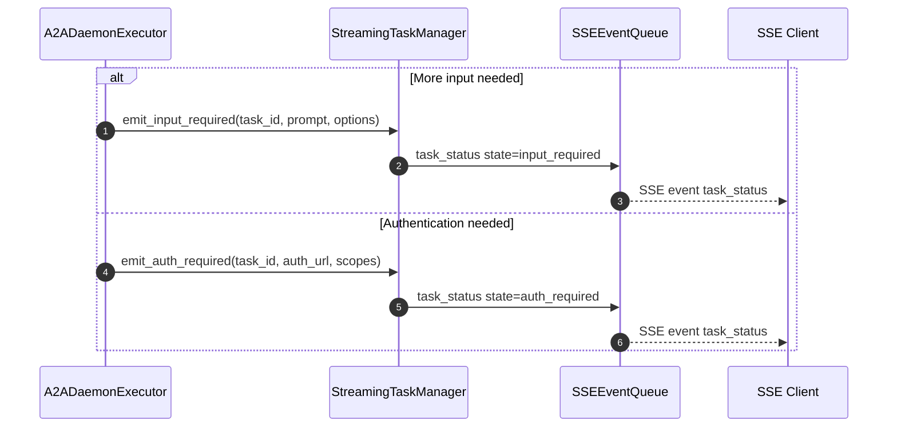

---

## 10. Push Notification Config

The push configuration manager supports create/get/list/delete and anti-SSRF validation. Route/RPC wiring should be verified for the selected deployment mode.

### 10.1 Create Task Push Notification Config

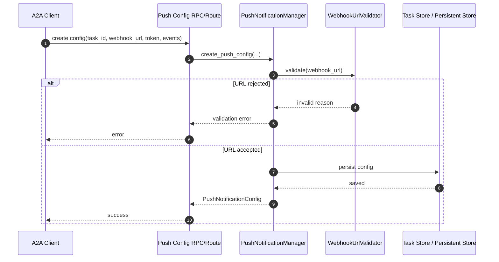

### 10.2 Get/List/Delete Task Push Notification Config

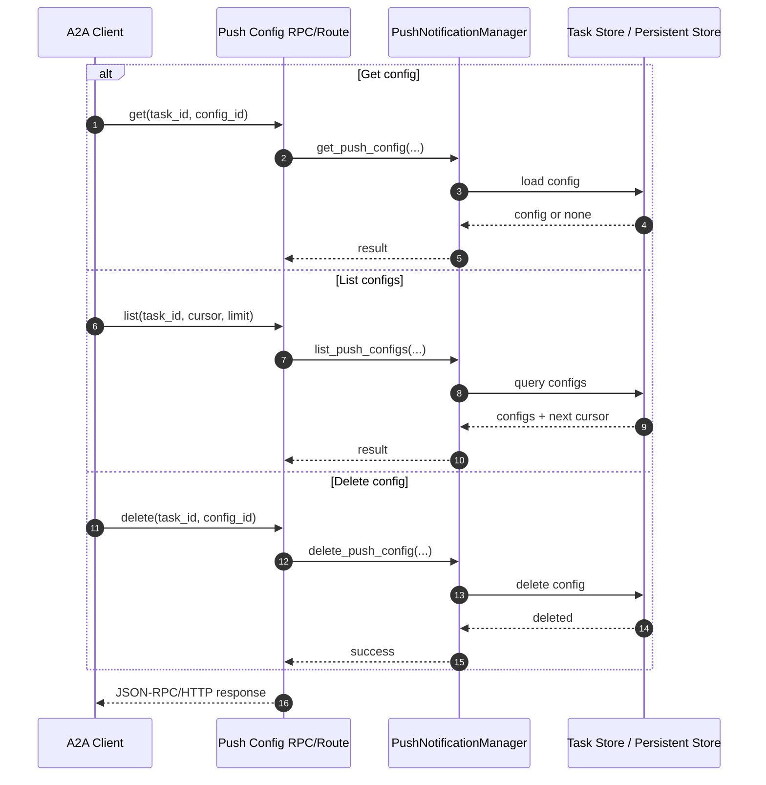

### 10.3 Push Notification Delivery

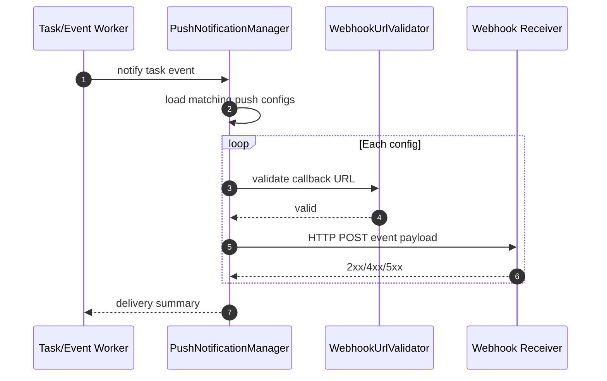

---

## 11. Legacy REST Compatibility Methods

These are not the primary A2A protocol methods, but they remain useful for SilvaEngine clients and tests.

### 11.1 Register Agent

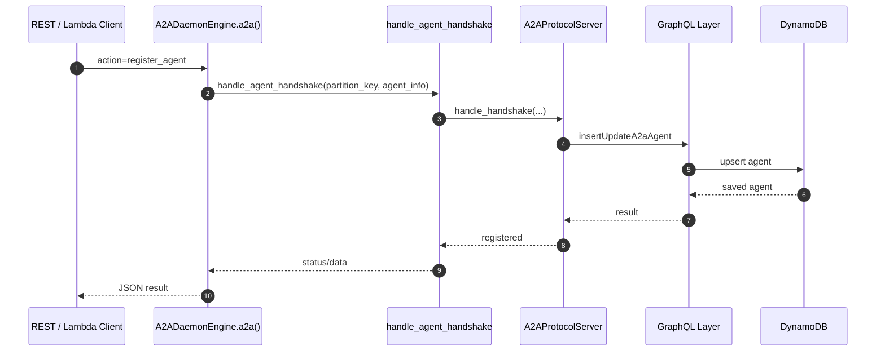

### 11.2 Assign Task

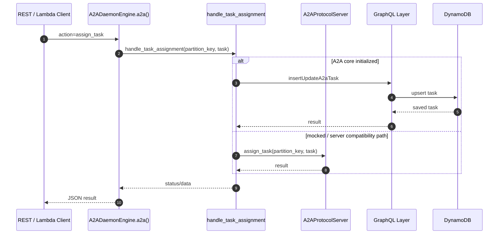

### 11.3 Route Message

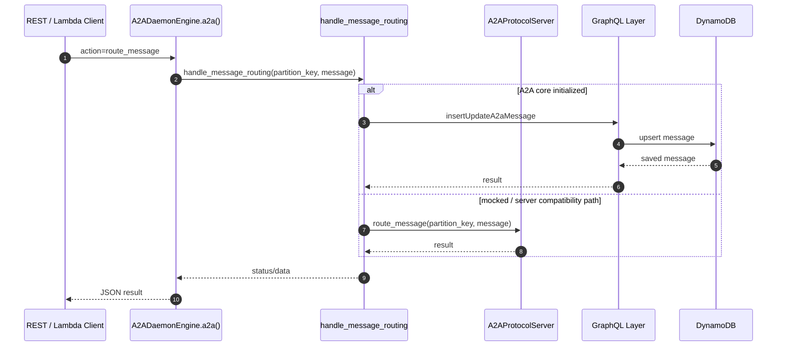

---

## 12. Experimental gRPC Transport

Phase 9 adds a JSON-over-gRPC adapter. It is not generated from protobuf stubs yet, so treat it as experimental.

### 12.1 gRPC `SendMessage`

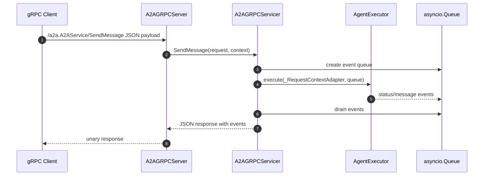

### 12.2 gRPC Streaming / Subscribe

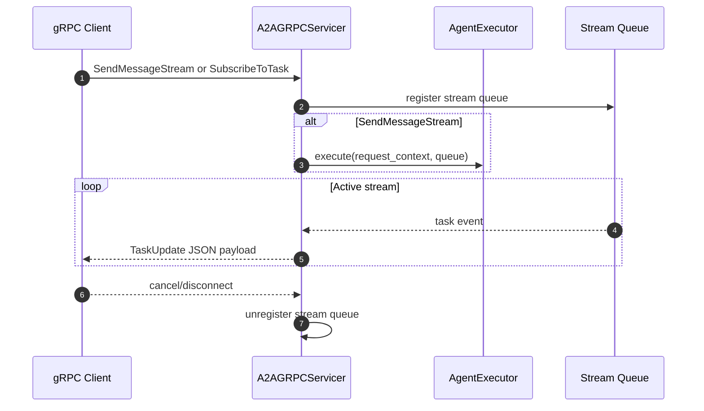

---

## 13. Method Coverage Summary

| A2A Method / Capability | Primary Implementation | Notes |
|---|---|---|
| Agent Card discovery | SDK Starlette app + `A2AProtocolServer.agent_card` | Public card is primary; extended card is helper-managed |
| `message/send` | SDK `DefaultRequestHandler` + `A2ADaemonExecutor` | Implemented |
| Streaming message | SDK stream path + `a2a_sse.py` helpers | Requires live client validation |
| `tasks/get` | SDK handler + `DynamoDBA2ATaskStore.get` | Implemented |
| Task list | `DynamoDBA2ATaskStore.list_tasks` | Implemented at store layer |
| `tasks/cancel` | SDK handler + `A2ADaemonExecutor.cancel` | Implemented |
| Subscribe to task | `GET /tasks/{task_id}/stream` | SSE replay via `Last-Event-ID` |
| Push config create/get/list/delete | `a2a_pushconfig.py` | Helper complete; route/RPC wiring should be verified |
| Authenticated extended card | `a2a_extended_card.py` | Helper complete; route wiring should be verified |
| gRPC Send/Get/List/Cancel/Subscribe | `a2a_grpc.py` | Experimental JSON-over-gRPC adapter |
| REST register/assign/route/execute | `A2ADaemonEngine.a2a()` + `a2a_handlers.py` | Compatibility surface, not the primary A2A protocol path |

---

## 14. Open Architecture Questions

1. **Generated protobuf gRPC:** The gRPC adapter should be replaced or supplemented with generated protobuf service stubs before production use.
2. **Push config exposure:** `a2a_pushconfig.py` has the manager logic; the exact public JSON-RPC/REST exposure should be verified in the selected runtime.
3. **Extended card endpoint:** The helper supports authenticated extended cards and cache headers; route registration should be confirmed against the deployed SDK app.
4. **Live TCK validation:** The default test suite avoids AWS and live daemon dependencies. Release certification still needs TCK/Inspector runs against a running daemon with the intended persistence backend.
5. **Task event source of truth:** SSE currently has an in-memory replay buffer. If replay must survive process restart, events should be persisted alongside task history.
