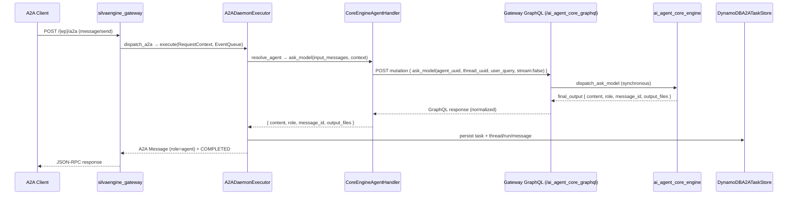
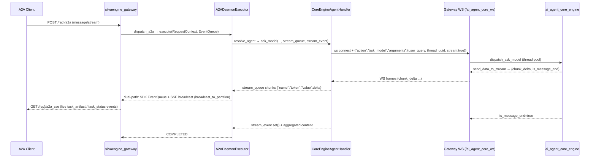

# A2A Development Plan

**Target Protocol:** A2A SDK v1.0

## Phase 1-3: Core SDK Alignment

**Status:** Complete

Established the foundational daemon infrastructure following the canonical A2A
SDK pattern.

- **AgentExecutor** implementation (`a2a_executor.py`) — canonical
  `AgentExecutor` from A2A SDK, routing `message_response`,
  `task_execution`, `message_routing`, and `agent_registration` operations
- **DynamoDBA2ATaskStore** (`a2a_taskstore.py`) — persistent task state backed
  by DynamoDB with composite partition keys (`{endpoint_id}#{part_id}`)
- **Async GraphQL wrappers** for CRUD operations on agents, tasks, messages,
  and settings
- **Multi-tenant data isolation** via composite partition keys
- **Dual authentication**: local JWT (HS256) and AWS Cognito (RS256 + JWKS)
- **Dual deployment**: HTTP (Uvicorn) and AWS Lambda (serverless)
- **Business handlers** (`a2a_handlers.py`) — handshake, routing, task
  assignment, message delivery
- **Configuration singleton** (`config.py`) with environment-variable driven
  settings
- **PynamoDB models** for Agent, Task, Message, Setting
- **GraphQL schema** (`a2a_core.py`, `schema.py`) with queries and mutations

Key files: `a2a_executor.py`, `a2a_taskstore.py`, `a2a_handlers.py`,
`a2a_server.py`, `a2a_app.py`, `config.py`, `jwt_local.py`, `jwt_cognito.py`,
`middleware.py`, plus all `models/`, `mutations/`, `queries/`, `types/`

## Phase 4: Server Restructuring

**Status:** Complete

Made the A2A SDK Starlette app the primary HTTP surface, demoting the legacy
FastAPI REST layer to an operations-only role.

- SDK Starlette application mounted at the HTTP root as primary A2A protocol
  surface
- FastAPI operations app mounted at `/rest` (secondary management API only)
- `/.well-known/agent-card.json` auto-exposed by SDK
- `POST /` for JSON-RPC compatibility (slash-style methods)
- Removed legacy `action=...` dispatch through `A2ADaemonEngine.a2a()`

Key files: `main.py` (mounts SDK app at root, FastAPI at `/rest`),
`a2a_server.py` (builds SDK Starlette app)

## Phase 5: Event-Driven Message Delivery

**Status:** Complete

Reliable message delivery with exponential-backoff retry and DynamoDB status
tracking.

- HTTP POST message delivery to agents
- 3-attempt exponential backoff (1s, 2s, 4s)
- DynamoDB status tracking for delivery attempts
- Agent registry and capability-based discovery (REST + GraphQL)

Key files: `a2a_handlers.py` (delivery + retry logic)

## Phase 6: A2A SDK v1.0 Upgrade and Enum/State Migration

**Status:** Complete

Upgraded from A2A SDK v0.3.x to v1.0.0, bringing type-system compliance and
protocol alignment.

| Task | Status |
|------|--------|
| Bump `a2a-sdk` from `^0.3.0` to `^1.0.0` | Complete |
| Migrate `TaskState` strings to `SCREAMING_SNAKE_CASE` | Complete |
| Add `AUTH_REQUIRED` and `REJECTED` states to status map | Complete |
| Fix `cancel()` to use `TaskState.canceled` enum and validate cancellable state | Complete |
| Thread `contextId` through executor and store | Complete |
| Replace `asyncio.run()` calls with `_run_async()` helper | Complete |
| Strip `from __future__ import print_function` from all handlers | Complete |
| Add `createdAt` / `lastModified` to Task model | Complete |
| Implement `GetTask` + `ListTasks` with cursor pagination | Complete |
| Fix broken `handle_agent_registration` import (now `handle_agent_handshake`) | Complete |
| Reject weak `JWT_SECRET_KEY` at startup | Complete |
| Mark hand-rolled JSON-RPC as deprecated | Complete |
| Implement `SendMessage` via SDK `DefaultRequestHandler` | Complete |

Test file: `tests/test_phase6.py`

Key files: `a2a_taskstore.py`, `a2a_executor.py`, `a2a_server.py`,
`models/a2a_task.py`, `main.py`, `config.py`

## Phase 7: Streaming and Multi-Turn

**Status:** Complete

Real-time SSE streaming, multi-turn conversations, push notification
configuration.

### Task 1: SendStreamingMessage (SSE)

- SSE event queue with ring buffer (100 events per task)
- `SSEEventQueue` for event buffering and replay
- `StreamingTaskManager` for status emission (`WORKING`, `COMPLETED`,
  `INPUT_REQUIRED`, `AUTH_REQUIRED`)

File: `a2a_sse.py`

### Task 2: SubscribeToTask with Last-Event-ID

- SSE reconnection with event replay buffer
- `/tasks/{task_id}/stream` route registered on SDK app

File: `a2a_sse.py`

### Task 3: INPUT_REQUIRED Transitions

- Multi-turn conversation support during task execution

File: `a2a_executor.py`

### Task 4: AUTH_REQUIRED Transitions

- Authentication-required state handling

File: `a2a_executor.py`

### Task 5: PushNotificationConfig CRUD

- A2A-standard `CreateTaskPushNotificationConfig`,
  `GetTaskPushNotificationConfig`, `ListTaskPushNotificationConfigs`,
  `DeleteTaskPushNotificationConfig`

File: `a2a_pushconfig.py`

### Task 7: Webhook URL Allowlist (Anti-SSRF)

- `WebhookUrlValidator` with allowlist, HTTPS enforcement, private CIDR
  blocking, SSRF bypass detection

File: `a2a_pushconfig.py`

### Other Phase 7 items

- `AgentCapabilities(streaming=True, pushNotifications=True)` set on Agent
  Card
- SSE streaming endpoints registered in `a2a_server.py`
- Streaming manager wired into `A2ADaemonExecutor`

## Phase 8: Production Hardening

**Status:** Complete

Security, observability, extended agent cards, TCK compliance preparations.

### Task 1: GetExtendedAgentCard with Authentication Gating

- `ExtendedAgentCardManager` with auth-gated access
- Security policies, rate limit configs, contact info

File: `a2a_extended_card.py`

### Task 2: Traceability Extension Registration

- `TraceabilityExtension` registered in Agent Card metadata
- Extension URI: `https://a2a-protocol.org/extensions/traceability/v1`

File: `a2a_extended_card.py`

### Task 3: OpenTelemetry Instrumentation

- `A2ATelemetry` for distributed tracing (HTTP + outbound httpx)
- Optional `[telemetry]` extra; degrades to no-op when not installed
- OTLP export support via `OTEL_EXPORTER_OTLP_ENDPOINT`

File: `a2a_telemetry.py`

### Other Phase 8 items

- Configurable CORS (no wildcard with auth)
- JWT weak-secret rejection at startup
- `ETag` / `Last-Modified` on Agent Card
- A2A TCK compliance tools (`a2a_tck_checker.py`, `a2a_rpc_verifier.py`)
- Comprehensive pytest suite (`test_phase8.py`,
  `test_executor_unit.py`, `test_handlers_unit.py`,
  `test_jwt_validation.py`, `validate_agent_card.py`)

Test file: `tests/test_phase8.py`

## Phase 9: Advanced Extensions and Optional Transports

**Status:** Complete

gRPC transport, GraphQL subscriptions, health monitoring, rate limiting,
cancellation propagation, secure passport, cost/quota visibility.

### Task 1: gRPC Transport

- `A2AGRPCServer` and `A2AGRPCClient` with JSON-over-gRPC protocol
- Bidirectional streaming support, flow control

File: `a2a_grpc.py`

### Task 2: GraphQL Subscriptions

- `SubscriptionManager` for live task/agent/message updates
- WebSocket-based real-time subscriptions

File: `a2a_graphql_subscriptions.py`

### Task 3: Agent Health Monitoring and Circuit Breakers

- `HealthMonitor` and `CircuitBreaker` classes
- Agent health checks, heartbeat monitoring, failover

File: `a2a_health_monitor.py`

### Task 4: Rate Limiting Extension

- `RateLimiter` with token bucket algorithm
- Per-skill rate limits in Agent Card
- `RateLimiterRegistry` for multi-skill management

File: `a2a_rate_limiter.py`

### Task 5: Cancellation Propagation

- `CancellationPropagator` for cascading cancellation down delegated chains
- Parent-child task reference tracking

File: `a2a_cancellation.py`

### Task 6: Secure Passport Extension

- `SecurePassportManager` scaffold for cross-trust-boundary identity
- Identity attestation, trust zone verification
- Status: Scaffold — full integration pending use case

File: `a2a_secure_passport.py`

### Task 7: Cost/Quota Visibility Extension

- `CostTracker` for per-task cost tracking
- `QuotaManager` for per-agent quota management and enforcement
- Status: Scaffold — billing system integration pending

File: `a2a_cost_extension.py`

Test file: `tests/test_phase9.py`

## Current State

The daemon now uses the SDK Starlette application as the only HTTP A2A
protocol surface:

- `GET /.well-known/agent-card.json`
- `POST /` (JSON-RPC compatibility endpoint: `message/send`, `tasks/get`, `tasks/cancel`)
- `POST /v1` (SDK native JSON-RPC dispatcher: `SendMessage`, `GetTask`, `CancelTask`)
- `GET /tasks/{task_id}/stream`

The FastAPI app mounted at `/rest` is limited to operations endpoints:

- `GET /rest/health`
- `GET /rest/me`
- `GET /rest/{endpoint_id}`
- `POST /rest/{endpoint_id}/a2a_core_graphql`

Removed protocol surfaces:

- `/rest/a2a-jsonrpc`
- `/rest/a2a/{endpoint_id}/...`
- `handlers/a2a_jsonrpc.py`
- `handlers/a2a_sdk_compat.py`
- direct `action=...` dispatch through `A2ADaemonEngine.a2a()`
- lowercase/pre-v1 task-state fallback helpers

## Implementation Notes

| Area | Status | Notes |
| --- | --- | --- |
| SDK app as primary HTTP app | Done | `main.py` mounts the SDK app at root and the operations app under `/rest`. |
| Agent Card | Done | `a2a_server.py` advertises protocol version `1.0.0`. |
| JSON-RPC protocol | Done | Slash-style compatibility JSON-RPC is served at `/`; native SDK JSON-RPC is served at `/v1`; serverless JSON-RPC dispatch remains available through `A2ADaemonEngine.a2a(**event)`. |
| Task state handling | Done | Internal helpers now resolve v1 uppercase state names only. |
| Task persistence | Done | `DynamoDBA2ATaskStore` implements SDK task-store methods and maps persisted states to v1 names. |
| Operations API | Done | `/rest` exposes health, identity, endpoint info, and GraphQL only. |
| gRPC adapter | Experimental | JSON-over-gRPC remains available for transport experimentation. |
| SSE infra fixes | Done | `a2a_sse.py` now skips the `None` sentinel, emits idle keep-alive comments, supports TTL cleanup for stale buffers, and registers routes through `app.add_route()` when available. |
| Dual event paths unconnected | Phase 10 | `SSEEventQueue` and SDK `EventQueue` are still parallel paths. Phase 10 streaming bridge must feed both; the SSE endpoint is now ready for `SubscribeToTask` reconnection traffic. |
| AI engine integration (non-streaming) | Phase 10 | Gateway-mediated GraphQL bridge to invoke `ai_agent_core_engine` `ask_model` for `SendMessage` requests with full persistence. |
| AI engine integration (streaming) | Phase 10 | Gateway-mediated WebSocket bridge using `threading.Queue` to emit chunks to both SDK `EventQueue` and `SSEEventQueue`. |

## Phase 10: Gateway-Mediated ai_agent_core_engine Integration

**Status:** Planned

### Motivation

The A2A daemon needs to invoke `ai_agent_core_engine` for LLM-backed `SendMessage`
and `SendStreamingMessage` requests. Rather than importing the core engine's
handler classes in-process (which couples the two modules and assumes a shared
Python runtime), all communication goes **through `silvaengine_gateway`** using
its public transport contracts. This decouples A2A from core-engine internals
and lets the core engine evolve independently.

Two distinct gateway transports are used, selected by request mode:

| Mode | Outbound Transport | Gateway Route |
| --- | --- | --- |
| **Non-streaming** (`SendMessage`) | **GraphQL** | `POST /{ep}/ai_agent_core_graphql` (gateway GraphQL mutations) |
| **Streaming** (`SendStreamingMessage`) | **WebSocket** | `/{ep}/ai_agent_core_ws` |

Client-facing streaming back to the A2A caller continues to use **SSE**
(the `/{ep}/a2a_sse` gateway route) — the daemon's existing streaming surface —
so no new client-facing transport is introduced.

### Transport Topology

| Leg | Direction | Transport | Gateway Route |
| --- | --- | --- | --- |
| Inbound | A2A client → `a2a_daemon_engine` | REST (JSON-RPC) + SSE | `POST /{ep}/a2a`, `GET/POST /{ep}/a2a_sse` |
| Outbound (non-streaming) | `a2a_daemon_engine` → `ai_agent_core_engine` | **GraphQL** | `POST /{ep}/ai_agent_core_graphql` |
| Outbound (streaming) | `a2a_daemon_engine` → `ai_agent_core_engine` | **WebSocket** | `/{ep}/ai_agent_core_ws` |

### Architecture — Non-Streaming (GraphQL)



### Architecture — Streaming (WebSocket)



### Handler Plugin Contract

The new `CoreEngineAgentHandler` (`handlers/a2a_core_engine_handler.py`)
implements the **same narrow bridge contract** as `HermesAgentHandler`, so the
executor and `a2a_ai_agent_utility.py` streaming/persistence machinery are
reused unchanged:

- `__init__(logger, agent_config, setting, context, ws_connect=None, graphql_client=None)` —
  the optional `ws_connect` factory allows a mock WebSocket in tests and
  `graphql_client` allows a mock GraphQL transport (parity with Hermes's
  injectable `http_transport`).
- `ask_model(input_messages, context, stream_queue=None, stream_event=None)` —
  streaming via WebSocket when `stream_queue` is provided, otherwise a single
  aggregated GraphQL mutation response dict `{content, role, metadata, error?}`.
- Optional `cancel_run(run_id)` / `resolve_approval(run_id, approved, reason)`
  for cancel and human-in-the-loop passthrough.

Selection is per-agent via registry metadata (no executor change):

```
module_name: "a2a_daemon_engine.handlers.a2a_core_engine_handler"
class_name:  "CoreEngineAgentHandler"
```

### Gateway GraphQL Protocol (Non-Streaming)

The handler sends a GraphQL mutation to the gateway's
`/{endpoint_id}/ai_agent_core_graphql` route, which dispatches
`ask_model` synchronously to `ai_agent_core_engine` and returns the
aggregated final output.

| Step | Description |
| --- | --- |
| Request | `POST /{ep}/ai_agent_core_graphql` with mutation `ask_model(agent_uuid, thread_uuid, user_query, updated_by, stream:false)` |
| Response | `{ "data": { "ask_model": { "content": "...", "role": "assistant", "message_id": "...", "output_files": [...] } } }` |
| Error | `{ "errors": [{ "message": "..." }] }` |

The handler normalizes the GraphQL response into daemon-owned fields via
`normalize_final_output`.

### Gateway WebSocket Protocol (Streaming)

Reference client: `silvaengine_gateway/tests/chat_websocket.py`.

| Step | Frame |
| --- | --- |
| Connect | `ws://<gw-host>:<port>/{endpoint_id}/ai_agent_core_ws?token=<jwt>&part_id=<tenant>` |
| Server ack | `{"type":"connection_ack","connection_id":"..."}` |
| Request | `{"action":"ask_model","arguments":{"agent_uuid","thread_uuid","user_query","updated_by","stream":true}}` |
| Stream chunk | `{"chunk_delta":"...","data_format":"text"|"xml","is_message_end":false}` |
| Stream end | frame with `"is_message_end":true` |
| Error | `{"type":"error","detail":"..."}` |

The handler translates each `chunk_delta` frame into a `stream_queue`
`{"name":"token","value":delta}` chunk and stops on `is_message_end` / error,
setting `stream_event` — identical downstream handling to the Hermes handler.

### A2A State Mapping

| Gateway frame / response | A2A Task State | Bridge action |
| --- | --- | --- |
| WS `connection_ack` / GraphQL 200 OK | `WORKING` | Connection/request established; begin run |
| WS `chunk_delta` (text) | `WORKING` | `token` chunk → A2A text artifact (SDK + SSE) |
| WS `chunk_delta` (xml / reasoning) | `WORKING` | `token` chunk, tagged by `data_format` |
| GraphQL `ask_model` result | `COMPLETED` | Normalize output; persist final message |
| WS `is_message_end=true` | `COMPLETED` | Set `stream_event`; persist final message |
| WS `{"type":"error"}` / GraphQL errors | `FAILED` | `error` chunk; set `FAILED` |
| `tasks/cancel` (from A2A client) | `CANCELED` | Close WS; `stream_event.set()` |

### Bridge Utility — Agent Resolution and Persistence

The existing `handlers/a2a_ai_agent_utility.py` provides the foundational
functions used by **both** the non-streaming and streaming paths:

| Function | Description |
| --- | --- |
| `resolve_agent(partition_key, agent_uuid)` | Query `Config.a2a_core` GraphQL to fetch the full agent configuration record, including LLM module name, class name, and agent-level settings. |
| `build_input_messages(partition_key, thread_uuid, num_of_messages, tool_call_role)` | Fetch conversation history from the core engine's message and tool-call stores so the LLM receives the same context it would in the core engine. |
| `normalize_final_output(output)` | Validate and normalize output into daemon-owned fields: `content`, `role`, `message_id`, `output_files`, `metadata`, and optional `error`. |
| `persist_thread_run_message(...)` | Persist thread, run, and message records through gateway GraphQL mutations, mirroring the core engine's `insert_update_thread` / `insert_update_run` / `insert_update_message` sequence. |

The `load_agent_handler` and `create_core_engine_context` functions from the
old in-process bridge are **removed** — the handler no longer imports
core-engine internals. Instead, `CoreEngineAgentHandler` encapsulates all
core-engine communication over gateway transports.

### Tasks

#### 10.0 Preflight and Compatibility Contract

| Sub-task | Description |
| --- | --- |
| 10.0.1 | Verify the gateway GraphQL `ask_model` mutation schema and the WebSocket `ask_model` action contract. Record signatures, chunk shape, timeout behavior, and final output shape in `tests/test_phase10.py` fixtures. |
| 10.0.2 | Define request metadata accepted by the executor: `agent_uuid`/`agentId`, `thread_uuid`/`threadId`, `run_uuid`/`runId`, `stream`, `streaming`, and `task_data`. Keep `dry_run` behavior unchanged. |
| 10.0.3 | Define the bridge result dataclasses or typed dicts used internally by the daemon, so executor code does not depend directly on gateway response dictionaries. |
| 10.0.4 | Add graceful fallback behavior when the gateway is unreachable: configuration validation should report Phase 10 as unavailable, while existing dry-run and task-assignment paths continue to work. |

#### 10.1 Handler Plugin — CoreEngineAgentHandler

Create `handlers/a2a_core_engine_handler.py` implementing the narrow bridge
contract over gateway transports.

| Sub-task | Description |
| --- | --- |
| 10.1.1 | `CoreEngineAgentHandler.__init__(logger, agent_config, setting, context, ws_connect=None, graphql_client=None)` — accept injectable transports for testing. |
| 10.1.2 | `ask_model(input_messages, context, stream_queue=None, stream_event=None)` — streaming via WebSocket when `stream_queue` is provided; non-streaming via GraphQL mutation otherwise. |
| 10.1.3 | Non-streaming: POST GraphQL mutation to `/{ep}/ai_agent_core_graphql`, parse response, normalize via `normalize_final_output`. |
| 10.1.4 | Streaming: connect to `/{ep}/ai_agent_core_ws`, send `ask_model` action, drain WS frames into `stream_queue` as `{"name":"token","value":delta}` chunks, stop on `is_message_end` or error. |
| 10.1.5 | Optional `cancel_run(run_id)` — close WS and set `stream_event` for streaming; no-op for non-streaming (already returned). |
| 10.1.6 | Optional `resolve_approval(run_id, approved, reason)` — send approval response via gateway GraphQL mutation. |

#### 10.2 Executor Wiring

| Sub-task | Description |
| --- | --- |
| 10.2.1 | Wire the non-streaming path into `A2ADaemonExecutor._handle_message_response()` and `_handle_task_execution()` — resolve agent UUID from request metadata (or fall back to `A2A_DEFAULT_AGENT_UUID`), invoke `handler.ask_model` (GraphQL), emit text result as `_agent_text_message(...)` + `COMPLETED`. |
| 10.2.2 | Wire the streaming path into `A2ADaemonExecutor._handle_task_execution()` — when request context indicates streaming (`SendStreamingMessage`, `stream`, or `streaming` metadata), call `handler.ask_model` with `stream_queue` + `stream_event`. |
| 10.2.3 | Thread-to-async adapter — `async def _drain_stream_queue(...)` polls the synchronous `stream_queue` via `run_in_executor` without blocking the event loop. |
| 10.2.4 | Thread lifecycle — background thread is daemonized, has a timeout (default `core_engine_stream_timeout`), and `stream_event` is always set on error or cancellation. |
| 10.2.5 | Persist thread, run, and message records through gateway GraphQL mutations after each invocation (both streaming and non-streaming). |
| 10.2.6 | Error mapping — agent-not-found, gateway timeout, GraphQL errors, WS errors, and invalid-response all map to A2A `FAILED` status with descriptive error message and classification metadata. |

#### 10.3 Dual-Path Streaming Emission

Ensure every chunk emitted by the streaming bridge reaches both A2A
protocol consumers and SSE reconnection subscribers.

| Sub-task | Description |
| --- | --- |
| 10.3.1 | Emit each text chunk into the **SDK `EventQueue`** as an A2A `Message` (via `_emit_event` + `_agent_text_message`). This serves `SendStreamingMessage` clients. |
| 10.3.2 | Emit each text chunk into the **`SSEEventQueue`** via `streaming_manager.emit_task_artifact()`. This serves `SubscribeToTask` and `/tasks/{task_id}/stream` reconnection clients. |
| 10.3.3 | On stream completion, emit `COMPLETED` to both SDK `EventQueue` and `SSEEventQueue.emit_task_status()`. On error, emit `FAILED`. |
| 10.3.4 | On `INPUT_REQUIRED` or `AUTH_REQUIRED` transitions from the core engine, map those to the corresponding A2A task states. |

#### 10.4 Configuration

| Sub-task | Description |
| --- | --- |
| 10.4.1 | Add `core_engine_*` settings to `Config._set_parameters` with env-var overrides and per-agent metadata injection (same pattern as `hermes_*`). |
| 10.4.2 | Document required settings in `AGENTS.md` (e.g., `CORE_ENGINE_WS_URL`, `CORE_ENGINE_TOKEN`, `CORE_ENGINE_GRAPHQL_URL`, `CORE_ENGINE_AGENT_UUID`). |
| 10.4.3 | Add environment-variable overrides for dev vs. production (e.g., disable streaming for local dev, set `stream_timeout` defaults, allow non-streaming-only mode). |
| 10.4.4 | Expose a startup/readiness flag for Phase 10 availability so tests and operators can distinguish "gateway not configured" from request-time LLM failure. |

#### 10.5 Tests

| Sub-task | Description |
| --- | --- |
| 10.5.1 | `tests/test_phase10.py` — Unit tests for preflight compatibility, `resolve_agent`, `build_input_messages`, `normalize_final_output`, and `persist_thread_run_message` with mocked gateway. |
| 10.5.2 | Non-streaming unit test — mock `graphql_client` returns `final_output`, verify A2A `Message` + `COMPLETED` emitted correctly. |
| 10.5.3 | Streaming unit test — mock `ws_connect` produces `chunk_delta` frames, verify: (a) each chunk → SDK `EventQueue`, (b) each chunk → `SSEEventQueue`, (c) `COMPLETED` or `FAILED` is final state. |
| 10.5.4 | Live API test — send `SendMessage` (non-streaming) to a running daemon and verify a single complete response is returned. |
| 10.5.5 | Live API test — send `SendStreamingMessage` to a running daemon and verify chunked text responses arrive over SSE. |
| 10.5.6 | Test error paths: agent-not-found, gateway timeout, GraphQL errors, WS error frame, invalid response — verify `FAILED` propagation for both non-streaming and streaming. |
| 10.5.7 | Test persistence — verify thread, run, and message records are created after both non-streaming and streaming invocations. |
| 10.5.8 | Test cancel passthrough — `tasks/cancel` closes the WS and sets `stream_event` for streaming; verify `CANCELED` state. |

### Implementation Order

1. **10.0** (Preflight contract) — Confirm gateway GraphQL `ask_model` mutation schema and WS action contract.
2. **10.1** (Handler plugin) — `CoreEngineAgentHandler` with GraphQL non-streaming + WS streaming, injectable transports for tests.
3. **10.2** (Executor wiring) — Wire non-streaming and streaming paths into the executor with persistence and error handling.
4. **10.3** (Dual-path emission) — Ensure both SSE and SDK paths receive streaming chunks.
5. **10.4** (Configuration) — Factor out hardcoded values and expose readiness.
6. **10.5** (Tests) — Written incrementally alongside each sub-task.

### Key Design Decisions

| Decision | Rationale |
| --- | --- |
| Gateway-mediated instead of in-process import | Coupling A2A to core-engine internals is brittle. Reusing the public gateway contracts (GraphQL + WebSocket) keeps the boundary identical to what external clients use and lets the core engine evolve independently. |
| GraphQL for non-streaming | `SendMessage` (non-streaming) is a synchronous request/response. GraphQL mutations are the natural fit — single round-trip, structured response, no connection overhead. The gateway already exposes `/{ep}/ai_agent_core_graphql` for this purpose. |
| WebSocket for streaming | `SendStreamingMessage` needs chunk-by-chunk delivery. The gateway's `ai_agent_core_ws` route already provides this via `send_data_to_stream` / `chunk_delta` frames. |
| Client-facing streaming stays on SSE | `message/stream` + `/a2a_sse` already deliver live tokens to A2A clients. The outbound GraphQL/WebSocket is strictly the A2A→core-engine leg; the transports do not overlap. |
| Same bridge contract as `HermesAgentHandler` | The executor, `stream_queue` drain loop, dual-path emission, and persistence are already generic over the handler. A new handler is the only new surface; selection is pure per-agent metadata. |
| Non-streaming is a first-class path | Many A2A clients will use `SendMessage` (non-streaming). This path must be fully production-grade with persistence, error handling, and response mapping. |
| `threading.Queue` to `asyncio` adapter via `run_in_executor` | The WS drain runs in a `threading.Thread` with `Queue`. The A2A executor is `async`. `run_in_executor` bridges without blocking the event loop. |
| Dual emission (SDK `EventQueue` + `SSEEventQueue`) | The SDK `EventQueue` serves `SendStreamingMessage` responses. The `SSEEventQueue` serves long-lived `SubscribeToTask` subscribers who reconnected with `Last-Event-ID`. Both need the same data. |
| Persist thread/run/message records in both paths | Conversation history must be queryable via the gateway GraphQL endpoint regardless of whether the client used streaming or non-streaming. |

## SSE Infrastructure Status

The SSE housekeeping items found during the Phase 10 review have been handled
in `a2a_sse.py` and covered by `test_phase8.py`. They are no longer Phase 10
blockers.

| Item | Status | Notes |
| --- | --- | --- |
| `subscribe()` sentinel handling | Done | `None` is consumed as an internal end-of-stream sentinel and is not yielded to clients. |
| Heartbeat/keep-alive | Done | Idle streams now emit periodic `: keep-alive` comments independent of event arrival. |
| Stale buffer cleanup | Done | `SSEEventQueue.cleanup_stale_buffers()` removes expired buffers with no active subscribers. |
| Route registration | Done | `create_sse_endpoints()` uses `app.add_route()` when available and keeps a list fallback. |
| Subscriber queue error handling | Done | `put()` handles cancellation and logs unexpected queue errors before dropping dead subscribers. |
| Dual event paths | Done | Both `SSEEventQueue` and SDK `EventQueue` fed from bridge utility via `_emit_to_sse()` and `_emit_to_sdk()`. |

## Release Gates

- Run unit tests with the local SilvaEngine dependency stack installed.
- Run live SDK/TCK or reference-client validation against a running daemon.
- Verify production configuration for auth, CORS, persistence, and streaming.
- Decide whether the experimental gRPC adapter should be promoted, rewritten with
  generated protobuf stubs, or kept out of production deployments.

## Phase Summary

| Phase | Theme | Status | Key Files |
| --- | --- | --- | --- |
| 1-3 | Core SDK alignment (AgentExecutor, TaskStore, async GraphQL wrappers) | Complete | `a2a_executor.py`, `a2a_taskstore.py`, `a2a_handlers.py`, `a2a_server.py` |
| 4 | Server restructuring (SDK app primary, FastAPI at /rest) | Complete | `main.py`, `a2a_server.py`, `a2a_app.py` |
| 5 | Event-driven message delivery (retry + status tracking) | Complete | `a2a_handlers.py` |
| 6 | A2A SDK v1.0 upgrade (state migration, enums, cursor pagination) | Complete | `a2a_taskstore.py`, `a2a_executor.py`, `models/a2a_task.py` |
| 7 | Streaming and multi-turn (SSE, INPUT_REQUIRED, AUTH_REQUIRED, push config) | Complete | `a2a_sse.py`, `a2a_pushconfig.py`, `a2a_executor.py` |
| 8 | Production hardening (extended cards, telemetry, TCK, security) | Complete | `a2a_extended_card.py`, `a2a_telemetry.py`, `a2a_tck_checker.py` |
| 9 | Advanced extensions (gRPC, subscriptions, health, rate limit, cancellation, passport, cost) | Complete | `a2a_grpc.py`, `a2a_graphql_subscriptions.py`, `a2a_health_monitor.py`, `a2a_rate_limiter.py`, `a2a_cancellation.py`, `a2a_secure_passport.py`, `a2a_cost_extension.py` |
| 10 | Gateway-mediated ai_agent_core_engine integration (GraphQL non-streaming + WebSocket streaming, dual-path emission, SSE client-facing) | Planned | `a2a_core_engine_handler.py` (new), `a2a_ai_agent_utility.py`, `a2a_executor.py`, `config.py`, `AGENTS.md`, `tests/test_phase10.py` |
