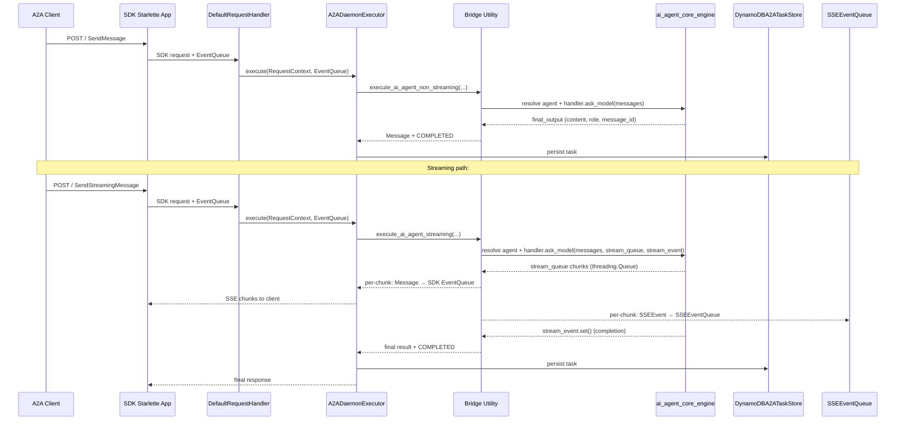

# A2A Development Plan

**Target Protocol:** A2A SDK v1.0

## Phase 1-3: Core SDK Alignment

**Status:** Complete

Established the foundational daemon infrastructure following the canonical A2A
SDK pattern.

- **AgentExecutor** implementation (`a2a_executor.py`) — canonical
  `AgentExecutor` from A2A SDK, routing `message_response`,
  `task_execution`, `message_routing`, and `agent_registration` operations
- **DynamoDBA2ATaskStore** (`a2a_taskstore.py`) — persistent task state backed
  by DynamoDB with composite partition keys (`{endpoint_id}#{part_id}`)
- **Async GraphQL wrappers** for CRUD operations on agents, tasks, messages,
  and settings
- **Multi-tenant data isolation** via composite partition keys
- **Dual authentication**: local JWT (HS256) and AWS Cognito (RS256 + JWKS)
- **Dual deployment**: HTTP (Uvicorn) and AWS Lambda (serverless)
- **Business handlers** (`a2a_handlers.py`) — handshake, routing, task
  assignment, message delivery
- **Configuration singleton** (`config.py`) with environment-variable driven
  settings
- **PynamoDB models** for Agent, Task, Message, Setting
- **GraphQL schema** (`a2a_core.py`, `schema.py`) with queries and mutations

Key files: `a2a_executor.py`, `a2a_taskstore.py`, `a2a_handlers.py`,
`a2a_server.py`, `a2a_app.py`, `config.py`, `jwt_local.py`, `jwt_cognito.py`,
`middleware.py`, plus all `models/`, `mutations/`, `queries/`, `types/`

## Phase 4: Server Restructuring

**Status:** Complete

Made the A2A SDK Starlette app the primary HTTP surface, demoting the legacy
FastAPI REST layer to an operations-only role.

- SDK Starlette application mounted at the HTTP root as primary A2A protocol
  surface
- FastAPI operations app mounted at `/rest` (secondary management API only)
- `/.well-known/agent-card.json` auto-exposed by SDK
- `POST /` for JSON-RPC compatibility (slash-style methods)
- Removed legacy `action=...` dispatch through `A2ADaemonEngine.a2a()`

Key files: `main.py` (mounts SDK app at root, FastAPI at `/rest`),
`a2a_server.py` (builds SDK Starlette app)

## Phase 5: Event-Driven Message Delivery

**Status:** Complete

Reliable message delivery with exponential-backoff retry and DynamoDB status
tracking.

- HTTP POST message delivery to agents
- 3-attempt exponential backoff (1s, 2s, 4s)
- DynamoDB status tracking for delivery attempts
- Agent registry and capability-based discovery (REST + GraphQL)

Key files: `a2a_handlers.py` (delivery + retry logic)

## Phase 6: A2A SDK v1.0 Upgrade and Enum/State Migration

**Status:** Complete

Upgraded from A2A SDK v0.3.x to v1.0.0, bringing type-system compliance and
protocol alignment.

| Task | Status |
|------|--------|
| Bump `a2a-sdk` from `^0.3.0` to `^1.0.0` | Complete |
| Migrate `TaskState` strings to `SCREAMING_SNAKE_CASE` | Complete |
| Add `AUTH_REQUIRED` and `REJECTED` states to status map | Complete |
| Fix `cancel()` to use `TaskState.canceled` enum and validate cancellable state | Complete |
| Thread `contextId` through executor and store | Complete |
| Replace `asyncio.run()` calls with `_run_async()` helper | Complete |
| Strip `from __future__ import print_function` from all handlers | Complete |
| Add `createdAt` / `lastModified` to Task model | Complete |
| Implement `GetTask` + `ListTasks` with cursor pagination | Complete |
| Fix broken `handle_agent_registration` import (now `handle_agent_handshake`) | Complete |
| Reject weak `JWT_SECRET_KEY` at startup | Complete |
| Mark hand-rolled JSON-RPC as deprecated | Complete |
| Implement `SendMessage` via SDK `DefaultRequestHandler` | Complete |

Test file: `tests/test_phase6.py`

Key files: `a2a_taskstore.py`, `a2a_executor.py`, `a2a_server.py`,
`models/a2a_task.py`, `main.py`, `config.py`

## Phase 7: Streaming and Multi-Turn

**Status:** Complete

Real-time SSE streaming, multi-turn conversations, push notification
configuration.

### Task 1: SendStreamingMessage (SSE)

- SSE event queue with ring buffer (100 events per task)
- `SSEEventQueue` for event buffering and replay
- `StreamingTaskManager` for status emission (`WORKING`, `COMPLETED`,
  `INPUT_REQUIRED`, `AUTH_REQUIRED`)

File: `a2a_sse.py`

### Task 2: SubscribeToTask with Last-Event-ID

- SSE reconnection with event replay buffer
- `/tasks/{task_id}/stream` route registered on SDK app

File: `a2a_sse.py`

### Task 3: INPUT_REQUIRED Transitions

- Multi-turn conversation support during task execution

File: `a2a_executor.py`

### Task 4: AUTH_REQUIRED Transitions

- Authentication-required state handling

File: `a2a_executor.py`

### Task 5: PushNotificationConfig CRUD

- A2A-standard `CreateTaskPushNotificationConfig`,
  `GetTaskPushNotificationConfig`, `ListTaskPushNotificationConfigs`,
  `DeleteTaskPushNotificationConfig`

File: `a2a_pushconfig.py`

### Task 7: Webhook URL Allowlist (Anti-SSRF)

- `WebhookUrlValidator` with allowlist, HTTPS enforcement, private CIDR
  blocking, SSRF bypass detection

File: `a2a_pushconfig.py`

### Other Phase 7 items

- `AgentCapabilities(streaming=True, pushNotifications=True)` set on Agent
  Card
- SSE streaming endpoints registered in `a2a_server.py`
- Streaming manager wired into `A2ADaemonExecutor`

## Phase 8: Production Hardening

**Status:** Complete

Security, observability, extended agent cards, TCK compliance preparations.

### Task 1: GetExtendedAgentCard with Authentication Gating

- `ExtendedAgentCardManager` with auth-gated access
- Security policies, rate limit configs, contact info

File: `a2a_extended_card.py`

### Task 2: Traceability Extension Registration

- `TraceabilityExtension` registered in Agent Card metadata
- Extension URI: `https://a2a-protocol.org/extensions/traceability/v1`

File: `a2a_extended_card.py`

### Task 3: OpenTelemetry Instrumentation

- `A2ATelemetry` for distributed tracing (HTTP + outbound httpx)
- Optional `[telemetry]` extra; degrades to no-op when not installed
- OTLP export support via `OTEL_EXPORTER_OTLP_ENDPOINT`

File: `a2a_telemetry.py`

### Other Phase 8 items

- Configurable CORS (no wildcard with auth)
- JWT weak-secret rejection at startup
- `ETag` / `Last-Modified` on Agent Card
- A2A TCK compliance tools (`a2a_tck_checker.py`, `a2a_rpc_verifier.py`)
- Comprehensive pytest suite (`test_phase8.py`,
  `test_executor_unit.py`, `test_handlers_unit.py`,
  `test_jwt_validation.py`, `validate_agent_card.py`)

Test file: `tests/test_phase8.py`

## Phase 9: Advanced Extensions and Optional Transports

**Status:** Complete

gRPC transport, GraphQL subscriptions, health monitoring, rate limiting,
cancellation propagation, secure passport, cost/quota visibility.

### Task 1: gRPC Transport

- `A2AGRPCServer` and `A2AGRPCClient` with JSON-over-gRPC protocol
- Bidirectional streaming support, flow control

File: `a2a_grpc.py`

### Task 2: GraphQL Subscriptions

- `SubscriptionManager` for live task/agent/message updates
- WebSocket-based real-time subscriptions

File: `a2a_graphql_subscriptions.py`

### Task 3: Agent Health Monitoring and Circuit Breakers

- `HealthMonitor` and `CircuitBreaker` classes
- Agent health checks, heartbeat monitoring, failover

File: `a2a_health_monitor.py`

### Task 4: Rate Limiting Extension

- `RateLimiter` with token bucket algorithm
- Per-skill rate limits in Agent Card
- `RateLimiterRegistry` for multi-skill management

File: `a2a_rate_limiter.py`

### Task 5: Cancellation Propagation

- `CancellationPropagator` for cascading cancellation down delegated chains
- Parent-child task reference tracking

File: `a2a_cancellation.py`

### Task 6: Secure Passport Extension

- `SecurePassportManager` scaffold for cross-trust-boundary identity
- Identity attestation, trust zone verification
- Status: Scaffold — full integration pending use case

File: `a2a_secure_passport.py`

### Task 7: Cost/Quota Visibility Extension

- `CostTracker` for per-task cost tracking
- `QuotaManager` for per-agent quota management and enforcement
- Status: Scaffold — billing system integration pending

File: `a2a_cost_extension.py`

Test file: `tests/test_phase9.py`

## Current State

The daemon now uses the SDK Starlette application as the only HTTP A2A
protocol surface:

- `GET /.well-known/agent-card.json`
- `POST /` (JSON-RPC compatibility endpoint: `message/send`, `tasks/get`, `tasks/cancel`)
- `POST /v1` (SDK native JSON-RPC dispatcher: `SendMessage`, `GetTask`, `CancelTask`)
- `GET /tasks/{task_id}/stream`

The FastAPI app mounted at `/rest` is limited to operations endpoints:

- `GET /rest/health`
- `GET /rest/me`
- `GET /rest/{endpoint_id}`
- `POST /rest/{endpoint_id}/a2a_core_graphql`

Removed protocol surfaces:

- `/rest/a2a-jsonrpc`
- `/rest/a2a/{endpoint_id}/...`
- `handlers/a2a_jsonrpc.py`
- direct `action=...` dispatch through `A2ADaemonEngine.a2a()`
- lowercase/pre-v1 task-state fallback helpers

## Implementation Notes

| Area | Status | Notes |
| --- | --- | --- |
| SDK app as primary HTTP app | Done | `main.py` mounts the SDK app at root and the operations app under `/rest`. |
| Agent Card | Done | `a2a_server.py` advertises protocol version `1.0.0`. |
| JSON-RPC protocol | Done | Native SDK JSON-RPC is served at `/`; serverless JSON-RPC dispatch remains available through `A2ADaemonEngine.a2a(**event)`. |
| Task state handling | Done | Internal helpers now resolve v1 uppercase state names only. |
| Task persistence | Done | `DynamoDBA2ATaskStore` implements SDK task-store methods and maps persisted states to v1 names. |
| Operations API | Done | `/rest` exposes health, identity, endpoint info, and GraphQL only. |
| gRPC adapter | Experimental | JSON-over-gRPC remains available for transport experimentation. |
| SSE infra fixes | Bug | `a2a_sse.py` has a `None` sentinel leak in `subscribe()`, no keep-alive heartbeat, no buffer cleanup, and a fragile route mutation. Not related to Phase 10 core engine work. |
| Dual event paths unconnected | Bug | `SSEEventQueue` and SDK `EventQueue` are parallel, disconnected paths. Phase 10 streaming bridge will feed both; the SSE endpoint will also be needed for `SubscribeToTask` reconnection. |
| AI engine integration (non-streaming) | Phase 10 | Bridge utility to invoke `ai_agent_core_engine` LLM handlers for `SendMessage` requests with full persistence. |
| AI engine integration (streaming) | Phase 10 | Streaming bridge using `threading.Queue` to emit chunks to both SDK `EventQueue` and `SSEEventQueue`. |

## Phase 10: ai_agent_core_engine Integration

### Problem

The daemon's SSE streaming infrastructure (`a2a_sse.py`) and the core engine's
LLM execution layer (`ai_agent_core_engine`) are completely disconnected:

- **ai_agent_core_engine** streams LLM output via a synchronous
  `threading.Thread` + `Queue` pattern (`stream_queue` / `stream_event`) and
  delivers WebSocket chunks through AWS API Gateway
  (`Config.apigw_client.post_to_connection`). It has no concept of A2A protocol
  events.

- **a2a_daemon_engine** has an `SSEEventQueue` + `StreamingTaskManager` for
  SSE broadcasting and an A2A SDK `EventQueue` for protocol-level streaming,
  but neither receives data from the core engine. The executor currently has a
  TODO stub (`a2a_executor.py:267`) where real LLM invocation should happen.

The result: task execution always emits static text responses; no LLM output
flows through A2A streaming.

### Architecture

### Tasks

#### 10.1 Bridge Utility — Agent Resolution and Handler Loading

Create a new module `handlers/a2a_ai_agent_utility.py` with the foundational
functions needed by *both* the non-streaming and streaming paths.

| Sub-task | Description |
| --- | --- |
| 10.1.1 | `resolve_agent(partition_key, agent_uuid)` — Query `Config.a2a_core` GraphQL to fetch the full agent configuration record, including LLM module name (`module_name`), LLM handler class name (`class_name`), and agent-level settings (instructions, num_of_messages, tool_call_role, mcp_servers). |
| 10.1.2 | `load_agent_handler(agent_config, context_setting)` — Use `Invoker.resolve_proxied_callable` (same dynamic-loading pattern as the core engine) to instantiate the AI agent handler class. Inject `logger`, `agent.__dict__`, and `setting` into the constructor. Return the handler instance. |
| 10.1.3 | `build_input_messages(partition_key, thread_uuid, num_of_messages, tool_call_role)` — Fetch conversation history from the core engine's message and tool-call stores so the LLM receives the same context it would in the core engine. This is needed for both non-streaming and streaming paths. |
| 10.1.4 | `create_core_engine_context(partition_key, setting, **kwargs)` — Assemble a minimal `ResolveInfo`-compatible context dict (containing `logger`, `setting`, `endpoint_id`, `part_id`, `partition_key`, `connection_id`, `context`) that the core engine's handler expects. Uses `create_listener_info` from `ai_agent_core_engine.utils.listener` when available, falls back to manual assembly otherwise. |

#### 10.2 Non-Streaming Integration

Invoke the core engine's LLM handler in a single-request/response mode and
return the final result as an A2A message. This is the production path for
all `SendMessage` calls that do not request streaming, and is the foundation
that streaming builds upon.

| Sub-task | Description |
| --- | --- |
| 10.2.1 | `execute_ai_agent_non_streaming(partition_key, agent_uuid, user_query, ...)` — Full lifecycle: resolve agent (10.1.1), load handler (10.1.2), build messages (10.1.3), call `handler.ask_model(input_messages)` synchronously, and return the final output dict (`content`, `message_id`, `role`). |
| 10.2.2 | Wire the non-streaming path into `A2ADaemonExecutor._handle_task_execution()` — replace the TODO stub at `a2a_executor.py:265-269`. When the request context does not indicate streaming, call `execute_ai_agent_non_streaming`, then emit the text result as `_agent_text_message(...)` and a `COMPLETED` status. |
| 10.2.3 | Wire the non-streaming path into `_handle_message_response()` — resolve the agent UUID from the request metadata (or fall back to a default agent), invoke the LLM, and return the response text. |
| 10.2.4 | Persist thread, run, and message records through `Config.a2a_core` GraphQL mutations after each non-streaming invocation, mirroring the core engine's `insert_update_thread` / `insert_update_run` / `insert_update_message` sequence. |
| 10.2.5 | Error mapping — agent-not-found, LLM timeout, handler import failure, and invalid-response errors all map to an A2A `FAILED` status event with a descriptive error message. Include error classification in the event metadata. |
| 10.2.6 | Non-streaming response format — The non-streaming `SendMessage` response must contain the full LLM output in a single A2A `Message` with `role=ROLE_AGENT`. Ensure `final_output` dict keys (`content`, `role`, `message_id`, `output_files`) are correctly mapped to A2A `Part` objects. |

#### 10.3 Streaming Integration

Invoke the core engine's LLM handler with a `threading.Queue` /
`threading.Event` pair and convert each chunk into A2A protocol events
as they arrive.

| Sub-task | Description |
| --- | --- |
| 10.3.1 | `execute_ai_agent_streaming(partition_key, agent_uuid, user_query, event_queue, streaming_manager, ...)` — Full lifecycle: resolve agent (10.1.1), load handler (10.1.2), build messages (10.1.3), create `Queue()` + `Event()`, run `handler.ask_model` in a background thread, drain the queue, and convert each chunk into A2A protocol events. |
| 10.3.2 | Thread-to-async adapter — Implement `async def _drain_stream_queue(stream_queue, stream_event, event_queue, sse_queue, task_id)` that uses `asyncio.get_running_loop().run_in_executor(None, stream_queue.get, True, 0.1)` to poll the synchronous queue without blocking the event loop. |
| 10.3.3 | Chunk-to-event conversion — Each queue item is a dict with `name` and `value` keys. Map `name="token"` chunks to `_agent_text_message(value)` and emit into the SDK `EventQueue`. Map `name="run_id"` to metadata (skip emitting as a message). Map `name="error"` to `FAILED` status. |
| 10.3.4 | Wire the streaming path into `A2ADaemonExecutor._handle_task_execution()` — When the request context indicates streaming (`SendStreamingMessage`), call `execute_ai_agent_streaming` instead of the non-streaming path. |
| 10.3.5 | Thread lifecycle management — Ensure the background `threading.Thread` is daemonized, has a timeout (default 120s matching the core engine), and that `stream_event` is always set on error or cancellation to prevent queue-drain hangs. |
| 10.3.6 | Persist thread, run, and message records after streaming completes — same pattern as 10.2.4 but deferred until `stream_event.wait()` returns. |

#### 10.4 Dual-Path Streaming Emission

Ensure every chunk emitted by the streaming bridge reaches both A2A
protocol consumers and SSE reconnection subscribers.

| Sub-task | Description |
| --- | --- |
| 10.4.1 | In the streaming bridge, emit each text chunk into the **SDK `EventQueue`** as an A2A `Message` (via `_emit_event` + `_agent_text_message`). This serves `SendStreamingMessage` clients. |
| 10.4.2 | In the streaming bridge, emit each text chunk into the **`SSEEventQueue`** via `streaming_manager.emit_task_artifact()`. This serves `SubscribeToTask` and `/tasks/{task_id}/stream` reconnection clients. |
| 10.4.3 | On stream completion, emit `COMPLETED` status to both the SDK `EventQueue` and `SSEEventQueue.emit_task_status()`. On error, emit `FAILED`. |
| 10.4.4 | On `INPUT_REQUIRED` or `AUTH_REQUIRED` transitions from the core engine, map those to the corresponding A2A task states. |

#### 10.5 Configuration

| Sub-task | Description |
| --- | --- |
| 10.5.1 | Add `ai_agent_core_setting` dict to `Config` holding module paths, class names, and connection parameters needed to invoke the core engine's AI agent handler. |
| 10.5.2 | Document required settings in `AGENTS.md` (e.g., `A2A_AI_AGENT_MODULE`, `A2A_AI_AGENT_CLASS`, `A2A_DEFAULT_AGENT_UUID`). |
| 10.5.3 | Add environment-variable overrides for dev vs. production (e.g., disable streaming for local dev, set `stream_timeout` defaults, allow non-streaming-only mode). |

#### 10.6 Tests

| Sub-task | Description |
| --- | --- |
| 10.6.1 | `tests/test_phase10.py` — Unit tests for `resolve_agent`, `load_agent_handler`, `create_core_engine_context`, and `build_input_messages` with mocked core engine. |
| 10.6.2 | Non-streaming integration test — call `execute_ai_agent_non_streaming` with a mock handler returning `final_output`, verify the A2A `Message` and `COMPLETED` status are emitted correctly. |
| 10.6.3 | Streaming integration test — call `execute_ai_agent_streaming` with a mock `threading.Queue` producing chunks, verify that: (a) each chunk is emitted to SDK `EventQueue`, (b) each chunk is broadcast to `SSEEventQueue`, (c) `COMPLETED` or `FAILED` is the final state. |
| 10.6.4 | Live API test — send `SendMessage` (non-streaming) to a running daemon and verify a single complete response is returned. |
| 10.6.5 | Live API test — send `SendStreamingMessage` to a running daemon and verify chunked text responses arrive over SSE. |
| 10.6.6 | Test error paths: agent-not-found, LLM timeout, LLM error, invalid `final_output` — verify `FAILED` state propagation for both non-streaming and streaming paths. |
| 10.6.7 | Test persistence — verify thread, run, and message records are created in DynamoDB after both non-streaming and streaming invocations. |

### Implementation Order

1. **10.1** (Bridge foundation) — Agent resolution, handler loading, context assembly, message building.
2. **10.2** (Non-streaming integration) — End-to-end LLM invocation with full persistence and error handling.
3. **10.3** (Streaming integration) — Adds chunk-by-chunk emission on top of the bridge foundation.
4. **10.4** (Dual-path emission) — Ensures both SSE and SDK paths receive streaming chunks.
5. **10.5** (Configuration) — Factor out hardcoded values.
6. **10.6** (Tests) — Written incrementally alongside each sub-task.

### Key Design Decisions

| Decision | Rationale |
| --- | --- |
| Bridge module instead of importing core engine directly | The core engine runs in a different runtime (Lambda/serverless with GraphQL context). A thin adapter in the daemon avoids coupling to its internal `ResolveInfo` / `Config` singletons. Both non-streaming and streaming paths share the same resolution and loading logic. |
| Non-streaming is a first-class path, not just a stepping stone | Many A2A clients will use `SendMessage` (non-streaming). This path must be fully production-grade with persistence, error handling, and response mapping — same quality as the core engine's own `execute_ask_model`. |
| Intercept `stream_queue` directly rather than rely on `send_data_to_stream` | `send_data_to_stream` requires an API Gateway `connection_id` for WebSocket push. In the daemon context there is no API Gateway; the bridge reads the queue directly in-process. |
| `threading.Queue` to `asyncio` adapter via `run_in_executor` | The core engine's `ask_model` runs in a `threading.Thread` with `Queue`. The A2A executor is `async`. `run_in_executor` bridges without blocking the event loop. |
| Dual emission (SDK `EventQueue` + `SSEEventQueue`) | The SDK `EventQueue` serves `SendStreamingMessage` responses. The `SSEEventQueue` serves long-lived `SubscribeToTask` subscribers who reconnected with `Last-Event-ID`. Both need the same data. |
| Persist thread/run/message records in both paths | The core engine creates thread, run, and message records in DynamoDB. The daemon must do the same so conversation history is queryable via the `/rest/{endpoint_id}/a2a_core_graphql` endpoint regardless of whether the client used streaming. |

## SSE Infrastructure Bugs

These are pre-existing defects in `a2a_sse.py` that were identified during the
Phase 10 review but are independent of the core engine integration. They should
be fixed as a separate housekeeping effort using the existing `test_phase8.py`
test harness.

| Bug | Description | Fix |
| --- | --- | --- |
| `subscribe()` yields `None` sentinel | `close_task()` puts `None` as a sentinel to signal end-of-stream, but `subscribe()` yields `None` to the consumer before the `break` check in `create_sse_response()`. This emits a `None` SSE event to clients. | Add `if event is None: break` before `yield event` in `subscribe()`, or change the yield to skip `None`. |
| No heartbeat/keep-alive | SSE connections idle for long periods. Without periodic `: comment\n\n` lines, load balancers and proxies may close the connection. | Add a periodic heartbeat (e.g. every 15s) in `create_sse_response()` by interleaving `: keep-alive\n\n` comments in the async generator. |
| `_event_buffers` memory growth | Ring buffers grow per `task_id` with no TTL or cleanup. Completed or abandoned tasks stay in memory indefinitely since `close_task()` is never called from anywhere in the codebase. | Add a TTL-based cleanup coroutine that removes buffers older than a configurable threshold, or call `close_task()` when a task transitions to a terminal state. |
| `create_sse_endpoints` mutates `app.routes` | Directly appending to `app.routes` is fragile and may not work with all Starlette routing configurations. | Use `app.add_route()` or rebuild the route list instead. |
| Dual event paths unconnected | `SSEEventQueue`/`StreamingTaskManager` and the SDK's `EventQueue` are parallel, disconnected paths. The executor only emits into the SDK `EventQueue`; the custom `/tasks/{task_id}/stream` SSE endpoint only serves events manually pushed into `SSEEventQueue`. | This is resolved by Phase 10 dual-path streaming (10.4), which will feed both queues from the bridge. |
| Broad `except Exception` in `put()` | `_subscriptions` dict mutation catches all `Exception` when putting to subscriber queues, silently swallowing errors that might indicate real problems. | Narrow the catch to `asyncio.CancelledError` or specific queue-closed exceptions; log unexpected errors rather than silently discarding them. |

## Release Gates

- Run unit tests with the local SilvaEngine dependency stack installed.
- Run live SDK/TCK or reference-client validation against a running daemon.
- Verify production configuration for auth, CORS, persistence, and streaming.
- Decide whether the experimental gRPC adapter should be promoted, rewritten with
  generated protobuf stubs, or kept out of production deployments.

## Phase Summary

| Phase | Theme | Status | Key Files |
| --- | --- | --- | --- |
| 1-3 | Core SDK alignment (AgentExecutor, TaskStore, async GraphQL wrappers) | Complete | `a2a_executor.py`, `a2a_taskstore.py`, `a2a_handlers.py`, `a2a_server.py` |
| 4 | Server restructuring (SDK app primary, FastAPI at /rest) | Complete | `main.py`, `a2a_server.py`, `a2a_app.py` |
| 5 | Event-driven message delivery (retry + status tracking) | Complete | `a2a_handlers.py` |
| 6 | A2A SDK v1.0 upgrade (state migration, enums, cursor pagination) | Complete | `a2a_taskstore.py`, `a2a_executor.py`, `models/a2a_task.py` |
| 7 | Streaming and multi-turn (SSE, INPUT_REQUIRED, AUTH_REQUIRED, push config) | Complete | `a2a_sse.py`, `a2a_pushconfig.py`, `a2a_executor.py` |
| 8 | Production hardening (extended cards, telemetry, TCK, security) | Complete | `a2a_extended_card.py`, `a2a_telemetry.py`, `a2a_tck_checker.py` |
| 9 | Advanced extensions (gRPC, subscriptions, health, rate limit, cancellation, passport, cost) | Complete | `a2a_grpc.py`, `a2a_graphql_subscriptions.py`, `a2a_health_monitor.py`, `a2a_rate_limiter.py`, `a2a_cancellation.py`, `a2a_secure_passport.py`, `a2a_cost_extension.py` |
| 10 | ai_agent_core_engine integration (bridge utility, non-streaming + streaming LLM, dual-path emission) | Planned | Planned: `a2a_ai_agent_utility.py`, updates to `a2a_executor.py`, `a2a_sse.py` |