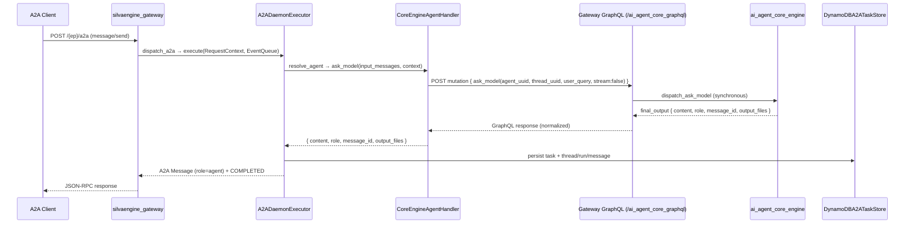
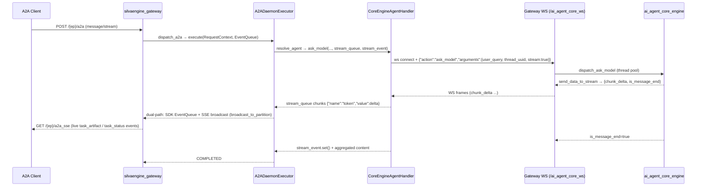

# A2A Development Plan

**Target Protocol:** A2A SDK v1.0

## Phase 1-3: Core SDK Alignment

**Status:** Complete

Established the foundational daemon infrastructure following the canonical A2A
SDK pattern.

- **AgentExecutor** implementation (`a2a_executor.py`) — canonical
  `AgentExecutor` from A2A SDK, routing `message_response`,
  `task_execution`, `message_routing`, and `agent_registration` operations
- **DynamoDBA2ATaskStore** (`a2a_taskstore.py`) — persistent task state backed
  by DynamoDB with composite partition keys (`{endpoint_id}#{part_id}`)
- **Async GraphQL wrappers** for CRUD operations on agents, tasks, messages,
  and settings
- **Multi-tenant data isolation** via composite partition keys
- **Dual authentication**: local JWT (HS256) and AWS Cognito (RS256 + JWKS)
- **Dual deployment**: HTTP (Uvicorn) and AWS Lambda (serverless)
- **Business handlers** (`a2a_handlers.py`) — handshake, routing, task
  assignment, message delivery
- **Configuration singleton** (`config.py`) with environment-variable driven
  settings
- **PynamoDB models** for Agent, Task, Message, Setting
- **GraphQL schema** (`a2a_core.py`, `schema.py`) with queries and mutations

Key files: `a2a_executor.py`, `a2a_taskstore.py`, `a2a_handlers.py`,
`a2a_server.py`, `a2a_app.py`, `config.py`, `jwt_local.py`, `jwt_cognito.py`,
`middleware.py`, plus all `models/`, `mutations/`, `queries/`, `types/`

## Phase 4: Server Restructuring

**Status:** Complete

Made the A2A SDK Starlette app the primary HTTP surface, demoting the legacy
FastAPI REST layer to an operations-only role.

- SDK Starlette application mounted at the HTTP root as primary A2A protocol
  surface
- FastAPI operations app mounted at `/rest` (secondary management API only)
- `/.well-known/agent-card.json` auto-exposed by SDK
- `POST /` for JSON-RPC compatibility (slash-style methods)
- Removed legacy `action=...` dispatch through `A2ADaemonEngine.a2a()`

Key files: `main.py` (mounts SDK app at root, FastAPI at `/rest`),
`a2a_server.py` (builds SDK Starlette app)

## Phase 5: Event-Driven Message Delivery

**Status:** Complete

Reliable message delivery with exponential-backoff retry and DynamoDB status
tracking.

- HTTP POST message delivery to agents
- 3-attempt exponential backoff (1s, 2s, 4s)
- DynamoDB status tracking for delivery attempts
- Agent registry and capability-based discovery (REST + GraphQL)

Key files: `a2a_handlers.py` (delivery + retry logic)

## Phase 6: A2A SDK v1.0 Upgrade and Enum/State Migration

**Status:** Complete

Upgraded from A2A SDK v0.3.x to v1.0.0, bringing type-system compliance and
protocol alignment.

| Task | Status |
|------|--------|
| Bump `a2a-sdk` from `^0.3.0` to `^1.0.0` | Complete |
| Migrate `TaskState` strings to `SCREAMING_SNAKE_CASE` | Complete |
| Add `AUTH_REQUIRED` and `REJECTED` states to status map | Complete |
| Fix `cancel()` to use `TaskState.canceled` enum and validate cancellable state | Complete |
| Thread `contextId` through executor and store | Complete |
| Replace `asyncio.run()` calls with `_run_async()` helper | Complete |
| Strip `from __future__ import print_function` from all handlers | Complete |
| Add `createdAt` / `lastModified` to Task model | Complete |
| Implement `GetTask` + `ListTasks` with cursor pagination | Complete |
| Fix broken `handle_agent_registration` import (now `handle_agent_handshake`) | Complete |
| Reject weak `JWT_SECRET_KEY` at startup | Complete |
| Mark hand-rolled JSON-RPC as deprecated | Complete |
| Implement `SendMessage` via SDK `DefaultRequestHandler` | Complete |

Test file: `tests/test_phase6.py`

Key files: `a2a_taskstore.py`, `a2a_executor.py`, `a2a_server.py`,
`models/a2a_task.py`, `main.py`, `config.py`

## Phase 7: Streaming and Multi-Turn

**Status:** Complete

Real-time SSE streaming, multi-turn conversations, push notification
configuration.

### Task 1: SendStreamingMessage (SSE)

- SSE event queue with ring buffer (100 events per task)
- `SSEEventQueue` for event buffering and replay
- `StreamingTaskManager` for status emission (`WORKING`, `COMPLETED`,
  `INPUT_REQUIRED`, `AUTH_REQUIRED`)

File: `a2a_sse.py`

### Task 2: SubscribeToTask with Last-Event-ID

- SSE reconnection with event replay buffer
- `/tasks/{task_id}/stream` route registered on SDK app

File: `a2a_sse.py`

### Task 3: INPUT_REQUIRED Transitions

- Multi-turn conversation support during task execution

File: `a2a_executor.py`

### Task 4: AUTH_REQUIRED Transitions

- Authentication-required state handling

File: `a2a_executor.py`

### Task 5: PushNotificationConfig CRUD

- A2A-standard `CreateTaskPushNotificationConfig`,
  `GetTaskPushNotificationConfig`, `ListTaskPushNotificationConfigs`,
  `DeleteTaskPushNotificationConfig`

File: `a2a_pushconfig.py`

### Task 7: Webhook URL Allowlist (Anti-SSRF)

- `WebhookUrlValidator` with allowlist, HTTPS enforcement, private CIDR
  blocking, SSRF bypass detection

File: `a2a_pushconfig.py`

### Other Phase 7 items

- `AgentCapabilities(streaming=True, pushNotifications=True)` set on Agent
  Card
- SSE streaming endpoints registered in `a2a_server.py`
- Streaming manager wired into `A2ADaemonExecutor`

## Phase 8: Production Hardening

**Status:** Complete

Security, observability, extended agent cards, TCK compliance preparations.

### Task 1: GetExtendedAgentCard with Authentication Gating

- `ExtendedAgentCardManager` with auth-gated access
- Security policies, rate limit configs, contact info

File: `a2a_extended_card.py`

### Task 2: Traceability Extension Registration

- `TraceabilityExtension` registered in Agent Card metadata
- Extension URI: `https://a2a-protocol.org/extensions/traceability/v1`

File: `a2a_extended_card.py`

### Task 3: OpenTelemetry Instrumentation

- `A2ATelemetry` for distributed tracing (HTTP + outbound httpx)
- Optional `[telemetry]` extra; degrades to no-op when not installed
- OTLP export support via `OTEL_EXPORTER_OTLP_ENDPOINT`

File: `a2a_telemetry.py`

### Other Phase 8 items

- Configurable CORS (no wildcard with auth)
- JWT weak-secret rejection at startup
- `ETag` / `Last-Modified` on Agent Card
- A2A TCK compliance tools (`a2a_tck_checker.py`, `a2a_rpc_verifier.py`)
- Comprehensive pytest suite (`test_phase8.py`,
  `test_executor_unit.py`, `test_handlers_unit.py`,
  `test_jwt_validation.py`, `validate_agent_card.py`)

Test file: `tests/test_phase8.py`

## Phase 9: Advanced Extensions and Optional Transports

**Status:** Complete

gRPC transport, GraphQL subscriptions, health monitoring, rate limiting,
cancellation propagation, secure passport, cost/quota visibility.

### Task 1: gRPC Transport

- `A2AGRPCServer` and `A2AGRPCClient` with JSON-over-gRPC protocol
- Bidirectional streaming support, flow control

File: `a2a_grpc.py`

### Task 2: GraphQL Subscriptions

- `SubscriptionManager` for live task/agent/message updates
- WebSocket-based real-time subscriptions

File: `a2a_graphql_subscriptions.py`

### Task 3: Agent Health Monitoring and Circuit Breakers

- `HealthMonitor` and `CircuitBreaker` classes
- Agent health checks, heartbeat monitoring, failover

File: `a2a_health_monitor.py`

### Task 4: Rate Limiting Extension

- `RateLimiter` with token bucket algorithm
- Per-skill rate limits in Agent Card
- `RateLimiterRegistry` for multi-skill management

File: `a2a_rate_limiter.py`

### Task 5: Cancellation Propagation

- `CancellationPropagator` for cascading cancellation down delegated chains
- Parent-child task reference tracking

File: `a2a_cancellation.py`

### Task 6: Secure Passport Extension

- `SecurePassportManager` scaffold for cross-trust-boundary identity
- Identity attestation, trust zone verification
- Status: Scaffold — full integration pending use case

File: `a2a_secure_passport.py`

### Task 7: Cost/Quota Visibility Extension

- `CostTracker` for per-task cost tracking
- `QuotaManager` for per-agent quota management and enforcement
- Status: Scaffold — billing system integration pending

File: `a2a_cost_extension.py`

Test file: `tests/test_phase9.py`

## Current State

The daemon has two supported operating shapes:

1. **Standalone HTTP daemon** — the SDK Starlette app owns the public A2A
   protocol surface:
   - `GET /.well-known/agent-card.json`
   - `POST /` for slash-style JSON-RPC compatibility methods
   - `POST /v1` for the SDK dispatcher and native v1 method names
   - `GET /tasks/{task_id}/stream` for task SSE replay/subscription

2. **Gateway-dispatched daemon** — `silvaengine_gateway` invokes module-level
   dispatch functions:
   - `POST /{endpoint_id}/a2a` -> `dispatch_a2a()`
   - `GET /{endpoint_id}/.well-known/agent-card.json` -> `dispatch_agent_card()`
   - `POST /{endpoint_id}/a2a_core_graphql` -> `dispatch_graphql()`
   - `POST /{endpoint_id}/a2a_sse` -> `dispatch_sse_message()` where configured

The gateway/serverless JSON-RPC dispatch now routes the A2A method table needed
for compliance: `message/send`, `message/stream`, `message/sendStream`,
`tasks/get`, `tasks/list`, `tasks/cancel`, `tasks/resubscribe`,
`tasks/subscribe`, push-notification config create/get/list/delete aliases, and
authenticated extended-card aliases.

The FastAPI app mounted at `/rest` remains operations-only:

- `GET /rest/health`
- `GET /rest/me`
- `GET /rest/{endpoint_id}`
- `POST /rest/{endpoint_id}/a2a_core_graphql`
- `POST /rest/auth/token`

Removed protocol surfaces that should not be reintroduced:

- `/rest/a2a-jsonrpc`
- `/rest/a2a/{endpoint_id}/...`
- `handlers/a2a_jsonrpc.py`
- `handlers/a2a_sdk_compat.py`
- direct `action=...` dispatch through `A2ADaemonEngine.a2a()`
- lowercase/pre-v1 task-state fallback helpers
## Implementation Notes

| Area | Status | Notes |
| --- | --- | --- |
| SDK app as primary HTTP app | Done | `main.py` mounts the SDK app at root and the operations app under `/rest`. |
| Agent Card | Done | Standalone mode serves `/.well-known/agent-card.json`; gateway mode exposes `dispatch_agent_card()` and rewrites the advertised JSON-RPC URL per endpoint. |
| JSON-RPC protocol | Done | Slash-style compatibility JSON-RPC is served at `/`; native SDK JSON-RPC is served at `/v1`; gateway/serverless dispatch routes send, stream, get, list, cancel, resubscribe, push-config CRUD, and extended-card methods. |
| Task state handling | Done | Internal helpers resolve v1 uppercase state names and support `INPUT_REQUIRED`, `AUTH_REQUIRED`, `REJECTED`, cancellation, and failure states. |
| Task persistence | Done | `DynamoDBA2ATaskStore` implements SDK task-store methods and maps persisted states to v1 names; PostgreSQL support is available through the repository layer where configured. |
| Operations API | Done | `/rest` exposes health, identity, endpoint info, auth token, and GraphQL only. |
| gRPC adapter | Experimental | JSON-over-gRPC remains available for transport experimentation, not the baseline compliance path. |
| SSE infra fixes | Done | `a2a_sse.py` skips the `None` sentinel, emits idle keep-alive comments, supports TTL cleanup for stale buffers, and registers routes through `app.add_route()` when available. |
| Dual event paths | Done | Phase 10/13 bridge paths feed both SDK `EventQueue` and `SSEEventQueue`; gateway streaming still has a documented buffered-RPC deviation with live updates on `/a2a_sse`. |
| AI engine integration (non-streaming) | Implemented; live verification pending | Gateway-mediated GraphQL bridge invokes `ai_agent_core_engine` `ask_model` for `SendMessage` requests with persistence. |
| AI engine integration (streaming) | Implemented; live verification pending | Gateway-mediated WebSocket bridge uses `threading.Queue` to emit chunks to both SDK `EventQueue` and `SSEEventQueue`. |

## Phase 10: Gateway-Mediated ai_agent_core_engine Integration

**Status:** Implemented; live gateway verification pending

### Motivation

The A2A daemon needs to invoke `ai_agent_core_engine` for LLM-backed `SendMessage`
and `SendStreamingMessage` requests. Rather than importing the core engine's
handler classes in-process (which couples the two modules and assumes a shared
Python runtime), all communication goes **through `silvaengine_gateway`** using
its public transport contracts. This decouples A2A from core-engine internals
and lets the core engine evolve independently.

Two distinct gateway transports are used, selected by request mode:

| Mode | Outbound Transport | Gateway Route |
| --- | --- | --- |
| **Non-streaming** (`SendMessage`) | **GraphQL** | `POST /{ep}/ai_agent_core_graphql` (gateway GraphQL mutations) |
| **Streaming** (`SendStreamingMessage`) | **WebSocket** | `/{ep}/ai_agent_core_ws` |

Client-facing streaming back to the A2A caller continues to use **SSE**
(the `/{ep}/a2a_sse` gateway route) — the daemon's existing streaming surface —
so no new client-facing transport is introduced.

### Transport Topology

| Leg | Direction | Transport | Gateway Route |
| --- | --- | --- | --- |
| Inbound | A2A client → `a2a_daemon_engine` | REST (JSON-RPC) + SSE | `POST /{ep}/a2a`, `GET/POST /{ep}/a2a_sse` |
| Outbound (non-streaming) | `a2a_daemon_engine` → `ai_agent_core_engine` | **GraphQL** | `POST /{ep}/ai_agent_core_graphql` |
| Outbound (streaming) | `a2a_daemon_engine` → `ai_agent_core_engine` | **WebSocket** | `/{ep}/ai_agent_core_ws` |

### Architecture — Non-Streaming (GraphQL)


```mermaid
sequenceDiagram
    participant C as A2A Client
    participant GW as silvaengine_gateway
    participant EX as A2ADaemonExecutor
    participant H as CoreEngineAgentHandler
    participant GQL as Gateway GraphQL (/ai_agent_core_graphql)
    participant CE as ai_agent_core_engine
    participant TS as DynamoDBA2ATaskStore

    C->>GW: POST /{ep}/a2a  (message/send)
    GW->>EX: dispatch_a2a → execute(RequestContext, EventQueue)
    EX->>H: resolve_agent → ask_model(input_messages, context)
    H->>GQL: POST mutation { ask_model(agent_uuid, thread_uuid, user_query, stream:false) }
    GQL->>CE: dispatch_ask_model (synchronous)
    CE-->>GQL: final_output { content, role, message_id, output_files }
    GQL-->>H: GraphQL response (normalized)
    H-->>EX: { content, role, message_id, output_files }
    EX->>TS: persist task + thread/run/message
    EX-->>GW: A2A Message (role=agent) + COMPLETED
    GW-->>C: JSON-RPC response
```

### Architecture — Streaming (WebSocket)


```mermaid
sequenceDiagram
    participant C as A2A Client
    participant GW as silvaengine_gateway
    participant EX as A2ADaemonExecutor
    participant H as CoreEngineAgentHandler
    participant WS as Gateway WS (/ai_agent_core_ws)
    participant CE as ai_agent_core_engine

    C->>GW: POST /{ep}/a2a  (message/stream)
    GW->>EX: dispatch_a2a → execute(RequestContext, EventQueue)
    EX->>H: resolve_agent → ask_model(..., stream_queue, stream_event)
    H->>WS: ws connect + {"action":"ask_model","arguments":{user_query, thread_uuid, stream:true}}
    WS->>CE: dispatch_ask_model (thread pool)
    CE-->>WS: send_data_to_stream → {chunk_delta, is_message_end}
    WS-->>H: WS frames (chunk_delta ...)
    H-->>EX: stream_queue chunks {"name":"token","value":delta}
    EX-->>GW: dual-path: SDK EventQueue + SSE broadcast (broadcast_to_partition)
    GW-->>C: GET /{ep}/a2a_sse  (live task_artifact / task_status events)
    CE-->>WS: is_message_end=true
    H-->>EX: stream_event.set() + aggregated content
    EX-->>GW: COMPLETED
```

### Handler Plugin Contract

The new `CoreEngineAgentHandler` (`handlers/core_engine_handler.py`)
implements the **same narrow bridge contract** as `HermesAgentHandler`, so the
executor and `a2a_ai_agent_utility.py` streaming/persistence machinery are
reused unchanged:

- `__init__(logger, agent_config, setting, context, ws_connect=None, graphql_client=None)` —
  the optional `ws_connect` factory allows a mock WebSocket in tests and
  `graphql_client` allows a mock GraphQL transport (parity with Hermes's
  injectable `http_transport`).
- `ask_model(input_messages, context, stream_queue=None, stream_event=None)` —
  streaming via WebSocket when `stream_queue` is provided, otherwise a single
  aggregated GraphQL mutation response dict `{content, role, metadata, error?}`.
- Optional `cancel_run(run_id)` / `resolve_approval(run_id, approved, reason)`
  for cancel and human-in-the-loop passthrough.

Selection is per-agent via registry metadata (no executor change):

```
module_name: "a2a_daemon_engine.handlers.core_engine_handler"
class_name:  "CoreEngineAgentHandler"
```

### Gateway GraphQL Protocol (Non-Streaming)

The handler sends a GraphQL mutation to the gateway's
`/{endpoint_id}/ai_agent_core_graphql` route, which dispatches
`ask_model` synchronously to `ai_agent_core_engine` and returns the
aggregated final output.

| Step | Description |
| --- | --- |
| Request | `POST /{ep}/ai_agent_core_graphql` with mutation `ask_model(agent_uuid, thread_uuid, user_query, updated_by, stream:false)` |
| Response | `{ "data": { "ask_model": { "content": "...", "role": "assistant", "message_id": "...", "output_files": [...] } } }` |
| Error | `{ "errors": [{ "message": "..." }] }` |

The handler normalizes the GraphQL response into daemon-owned fields via
`normalize_final_output`.

### Gateway WebSocket Protocol (Streaming)

Reference client: `silvaengine_gateway/tests/chat_websocket.py`.

| Step | Frame |
| --- | --- |
| Connect | `ws://<gw-host>:<port>/{endpoint_id}/ai_agent_core_ws?token=<jwt>&part_id=<tenant>` |
| Server ack | `{"type":"connection_ack","connection_id":"..."}` |
| Request | `{"action":"ask_model","arguments":{"agent_uuid","thread_uuid","user_query","updated_by","stream":true}}` |
| Stream chunk | `{"chunk_delta":"...","data_format":"text"|"xml","is_message_end":false}` |
| Stream end | frame with `"is_message_end":true` |
| Error | `{"type":"error","detail":"..."}` |

The handler translates each `chunk_delta` frame into a `stream_queue`
`{"name":"token","value":delta}` chunk and stops on `is_message_end` / error,
setting `stream_event` — identical downstream handling to the Hermes handler.

### A2A State Mapping

| Gateway frame / response | A2A Task State | Bridge action |
| --- | --- | --- |
| WS `connection_ack` / GraphQL 200 OK | `WORKING` | Connection/request established; begin run |
| WS `chunk_delta` (text) | `WORKING` | `token` chunk → A2A text artifact (SDK + SSE) |
| WS `chunk_delta` (xml / reasoning) | `WORKING` | `token` chunk, tagged by `data_format` |
| GraphQL `ask_model` result | `COMPLETED` | Normalize output; persist final message |
| WS `is_message_end=true` | `COMPLETED` | Set `stream_event`; persist final message |
| WS `{"type":"error"}` / GraphQL errors | `FAILED` | `error` chunk; set `FAILED` |
| `tasks/cancel` (from A2A client) | `CANCELED` | Close WS; `stream_event.set()` |

### Bridge Utility — Agent Resolution and Persistence

The existing `handlers/a2a_ai_agent_utility.py` provides the foundational
functions used by **both** the non-streaming and streaming paths:

| Function | Description |
| --- | --- |
| `resolve_agent(partition_key, agent_uuid)` | Query `Config.a2a_core` GraphQL to fetch the full agent configuration record, including LLM module name, class name, and agent-level settings. |
| `build_input_messages(partition_key, thread_uuid, num_of_messages, tool_call_role)` | Fetch conversation history from the core engine's message and tool-call stores so the LLM receives the same context it would in the core engine. |
| `normalize_final_output(output)` | Validate and normalize output into daemon-owned fields: `content`, `role`, `message_id`, `output_files`, `metadata`, and optional `error`. |
| `persist_thread_run_message(...)` | Persist thread, run, and message records through gateway GraphQL mutations, mirroring the core engine's `insert_update_thread` / `insert_update_run` / `insert_update_message` sequence. |

The `load_agent_handler` and `create_core_engine_context` functions from the
old in-process bridge are **removed** — the handler no longer imports
core-engine internals. Instead, `CoreEngineAgentHandler` encapsulates all
core-engine communication over gateway transports.

### Tasks

#### 10.0 Preflight and Compatibility Contract

| Sub-task | Description |
| --- | --- |
| 10.0.1 | Verify the gateway GraphQL `ask_model` mutation schema and the WebSocket `ask_model` action contract. Record signatures, chunk shape, timeout behavior, and final output shape in `tests/test_phase10.py` fixtures. |
| 10.0.2 | Define request metadata accepted by the executor: `agent_uuid`/`agentId`, `thread_uuid`/`threadId`, `run_uuid`/`runId`, `stream`, `streaming`, and `task_data`. Keep `dry_run` behavior unchanged. |
| 10.0.3 | Define the bridge result dataclasses or typed dicts used internally by the daemon, so executor code does not depend directly on gateway response dictionaries. |
| 10.0.4 | Add graceful fallback behavior when the gateway is unreachable: configuration validation should report Phase 10 as unavailable, while existing dry-run and task-assignment paths continue to work. |

#### 10.1 Handler Plugin — CoreEngineAgentHandler

Create `handlers/core_engine_handler.py` implementing the narrow bridge
contract over gateway transports.

| Sub-task | Description |
| --- | --- |
| 10.1.1 | `CoreEngineAgentHandler.__init__(logger, agent_config, setting, context, ws_connect=None, graphql_client=None)` — accept injectable transports for testing. |
| 10.1.2 | `ask_model(input_messages, context, stream_queue=None, stream_event=None)` — streaming via WebSocket when `stream_queue` is provided; non-streaming via GraphQL mutation otherwise. |
| 10.1.3 | Non-streaming: POST GraphQL mutation to `/{ep}/ai_agent_core_graphql`, parse response, normalize via `normalize_final_output`. |
| 10.1.4 | Streaming: connect to `/{ep}/ai_agent_core_ws`, send `ask_model` action, drain WS frames into `stream_queue` as `{"name":"token","value":delta}` chunks, stop on `is_message_end` or error. |
| 10.1.5 | Optional `cancel_run(run_id)` — close WS and set `stream_event` for streaming; no-op for non-streaming (already returned). |
| 10.1.6 | Optional `resolve_approval(run_id, approved, reason)` — send approval response via gateway GraphQL mutation. |

#### 10.2 Executor Wiring

| Sub-task | Description |
| --- | --- |
| 10.2.1 | Wire the non-streaming path into `A2ADaemonExecutor._handle_message_response()` and `_handle_task_execution()` — resolve agent UUID from request metadata (or fall back to `A2A_DEFAULT_AGENT_UUID`), invoke `handler.ask_model` (GraphQL), emit text result as `_agent_text_message(...)` + `COMPLETED`. |
| 10.2.2 | Wire the streaming path into `A2ADaemonExecutor._handle_task_execution()` — when request context indicates streaming (`SendStreamingMessage`, `stream`, or `streaming` metadata), call `handler.ask_model` with `stream_queue` + `stream_event`. |
| 10.2.3 | Thread-to-async adapter — `async def _drain_stream_queue(...)` polls the synchronous `stream_queue` via `run_in_executor` without blocking the event loop. |
| 10.2.4 | Thread lifecycle — background thread is daemonized, has a timeout (default `core_engine_stream_timeout`), and `stream_event` is always set on error or cancellation. |
| 10.2.5 | Persist thread, run, and message records through gateway GraphQL mutations after each invocation (both streaming and non-streaming). |
| 10.2.6 | Error mapping — agent-not-found, gateway timeout, GraphQL errors, WS errors, and invalid-response all map to A2A `FAILED` status with descriptive error message and classification metadata. |

#### 10.3 Dual-Path Streaming Emission

Ensure every chunk emitted by the streaming bridge reaches both A2A
protocol consumers and SSE reconnection subscribers.

| Sub-task | Description |
| --- | --- |
| 10.3.1 | Emit each text chunk into the **SDK `EventQueue`** as an A2A `Message` (via `_emit_event` + `_agent_text_message`). This serves `SendStreamingMessage` clients. |
| 10.3.2 | Emit each text chunk into the **`SSEEventQueue`** via `streaming_manager.emit_task_artifact()`. This serves `SubscribeToTask` and `/tasks/{task_id}/stream` reconnection clients. |
| 10.3.3 | On stream completion, emit `COMPLETED` to both SDK `EventQueue` and `SSEEventQueue.emit_task_status()`. On error, emit `FAILED`. |
| 10.3.4 | On `INPUT_REQUIRED` or `AUTH_REQUIRED` transitions from the core engine, map those to the corresponding A2A task states. |

#### 10.4 Configuration

| Sub-task | Description |
| --- | --- |
| 10.4.1 | Add `core_engine_*` settings to `Config._set_parameters` with env-var overrides and per-agent metadata injection (same pattern as `hermes_*`). |
| 10.4.2 | Document required settings in `AGENTS.md` (e.g., `CORE_ENGINE_WS_URL`, `CORE_ENGINE_TOKEN`, `CORE_ENGINE_GRAPHQL_URL`, `CORE_ENGINE_AGENT_UUID`). |
| 10.4.3 | Add environment-variable overrides for dev vs. production (e.g., disable streaming for local dev, set `stream_timeout` defaults, allow non-streaming-only mode). |
| 10.4.4 | Expose a startup/readiness flag for Phase 10 availability so tests and operators can distinguish "gateway not configured" from request-time LLM failure. |

#### 10.5 Tests

| Sub-task | Description |
| --- | --- |
| 10.5.1 | `tests/test_phase10.py` — Unit tests for preflight compatibility, `resolve_agent`, `build_input_messages`, `normalize_final_output`, and `persist_thread_run_message` with mocked gateway. |
| 10.5.2 | Non-streaming unit test — mock `graphql_client` returns `final_output`, verify A2A `Message` + `COMPLETED` emitted correctly. |
| 10.5.3 | Streaming unit test — mock `ws_connect` produces `chunk_delta` frames, verify: (a) each chunk → SDK `EventQueue`, (b) each chunk → `SSEEventQueue`, (c) `COMPLETED` or `FAILED` is final state. |
| 10.5.4 | Live API test — send `SendMessage` (non-streaming) to a running daemon and verify a single complete response is returned. |
| 10.5.5 | Live API test — send `SendStreamingMessage` to a running daemon and verify chunked text responses arrive over SSE. |
| 10.5.6 | Test error paths: agent-not-found, gateway timeout, GraphQL errors, WS error frame, invalid response — verify `FAILED` propagation for both non-streaming and streaming. |
| 10.5.7 | Test persistence — verify thread, run, and message records are created after both non-streaming and streaming invocations. |
| 10.5.8 | Test cancel passthrough — `tasks/cancel` closes the WS and sets `stream_event` for streaming; verify `CANCELED` state. |

### Implementation Order

1. **10.0** (Preflight contract) — Confirm gateway GraphQL `ask_model` mutation schema and WS action contract.
2. **10.1** (Handler plugin) — `CoreEngineAgentHandler` with GraphQL non-streaming + WS streaming, injectable transports for tests.
3. **10.2** (Executor wiring) — Wire non-streaming and streaming paths into the executor with persistence and error handling.
4. **10.3** (Dual-path emission) — Ensure both SSE and SDK paths receive streaming chunks.
5. **10.4** (Configuration) — Factor out hardcoded values and expose readiness.
6. **10.5** (Tests) — Written incrementally alongside each sub-task.

### Key Design Decisions

| Decision | Rationale |
| --- | --- |
| Gateway-mediated instead of in-process import | Coupling A2A to core-engine internals is brittle. Reusing the public gateway contracts (GraphQL + WebSocket) keeps the boundary identical to what external clients use and lets the core engine evolve independently. |
| GraphQL for non-streaming | `SendMessage` (non-streaming) is a synchronous request/response. GraphQL mutations are the natural fit — single round-trip, structured response, no connection overhead. The gateway already exposes `/{ep}/ai_agent_core_graphql` for this purpose. |
| WebSocket for streaming | `SendStreamingMessage` needs chunk-by-chunk delivery. The gateway's `ai_agent_core_ws` route already provides this via `send_data_to_stream` / `chunk_delta` frames. |
| Client-facing streaming stays on SSE | `message/stream` + `/a2a_sse` already deliver live tokens to A2A clients. The outbound GraphQL/WebSocket is strictly the A2A→core-engine leg; the transports do not overlap. |
| Same bridge contract as `HermesAgentHandler` | The executor, `stream_queue` drain loop, dual-path emission, and persistence are already generic over the handler. A new handler is the only new surface; selection is pure per-agent metadata. |
| Non-streaming is a first-class path | Many A2A clients will use `SendMessage` (non-streaming). This path must be fully production-grade with persistence, error handling, and response mapping. |
| `threading.Queue` to `asyncio` adapter via `run_in_executor` | The WS drain runs in a `threading.Thread` with `Queue`. The A2A executor is `async`. `run_in_executor` bridges without blocking the event loop. |
| Dual emission (SDK `EventQueue` + `SSEEventQueue`) | The SDK `EventQueue` serves `SendStreamingMessage` responses. The `SSEEventQueue` serves long-lived `SubscribeToTask` subscribers who reconnected with `Last-Event-ID`. Both need the same data. |
| Persist thread/run/message records in both paths | Conversation history must be queryable via the gateway GraphQL endpoint regardless of whether the client used streaming or non-streaming. |

## SSE Infrastructure Status

The SSE housekeeping items found during the Phase 10 review have been handled
in `a2a_sse.py` and covered by `test_phase8.py`. They are no longer Phase 10
blockers.

| Item | Status | Notes |
| --- | --- | --- |
| `subscribe()` sentinel handling | Done | `None` is consumed as an internal end-of-stream sentinel and is not yielded to clients. |
| Heartbeat/keep-alive | Done | Idle streams now emit periodic `: keep-alive` comments independent of event arrival. |
| Stale buffer cleanup | Done | `SSEEventQueue.cleanup_stale_buffers()` removes expired buffers with no active subscribers. |
| Route registration | Done | `create_sse_endpoints()` uses `app.add_route()` when available and keeps a list fallback. |
| Subscriber queue error handling | Done | `put()` handles cancellation and logs unexpected queue errors before dropping dead subscribers. |
| Dual event paths | Done | Both `SSEEventQueue` and SDK `EventQueue` fed from bridge utility via `_emit_to_sse()` and `_emit_to_sdk()`. |

## Release Gates

- Run unit tests with the local SilvaEngine dependency stack installed.
- Run live SDK/TCK or reference-client validation against a running daemon.
- Verify production configuration for auth, CORS, persistence, and streaming.
- Decide whether the experimental gRPC adapter should be promoted, rewritten with
  generated protobuf stubs, or kept out of production deployments.

## Phase Summary

| Phase | Theme | Status | Key Files |
| --- | --- | --- | --- |
| 1-3 | Core SDK alignment (AgentExecutor, TaskStore, async GraphQL wrappers) | Complete | `a2a_executor.py`, `a2a_taskstore.py`, `a2a_handlers.py`, `a2a_server.py` |
| 4 | Server restructuring (SDK app primary, FastAPI at /rest) | Complete | `main.py`, `a2a_server.py`, `a2a_app.py` |
| 5 | Event-driven message delivery (retry + status tracking) | Complete | `a2a_handlers.py` |
| 6 | A2A SDK v1.0 upgrade (state migration, enums, cursor pagination) | Complete | `a2a_taskstore.py`, `a2a_executor.py`, `models/a2a_task.py` |
| 7 | Streaming and multi-turn (SSE, INPUT_REQUIRED, AUTH_REQUIRED, push config) | Complete | `a2a_sse.py`, `a2a_pushconfig.py`, `a2a_executor.py` |
| 8 | Production hardening (extended cards, telemetry, TCK, security) | Complete | `a2a_extended_card.py`, `a2a_telemetry.py`, `a2a_tck_checker.py` |
| 9 | Advanced extensions (gRPC, subscriptions, health, rate limit, cancellation, passport, cost) | Complete | `a2a_grpc.py`, `a2a_graphql_subscriptions.py`, `a2a_health_monitor.py`, `a2a_rate_limiter.py`, `a2a_cancellation.py`, `a2a_secure_passport.py`, `a2a_cost_extension.py` |
| 10 | Gateway-mediated ai_agent_core_engine integration (GraphQL non-streaming + WebSocket streaming, dual-path emission, SSE client-facing) | Implemented; live gateway verification pending | `core_engine_handler.py` (new), `a2a_ai_agent_utility.py`, `a2a_executor.py`, `config.py`, `AGENTS.md`, `tests/test_phase10.py`, `tests/test_core_engine_handler.py` |
| 11 | A2A protocol compliance through the gateway (Agent Card discovery + expanded JSON-RPC routing) | Implemented in code; live gateway verification pending | `main.py`, `a2a_server.py`, `a2a_extended_card.py`, `a2a_pushconfig.py`, `a2a_pushconfig_store.py`, `tests/test_a2a_protocol_compliance.py` - see [`A2A_PROTOCOL_COMPLIANCE_PLAN.md`](A2A_PROTOCOL_COMPLIANCE_PLAN.md) |
| 12 | Conversation grouping via contextId (add context_id + role to a2a_messages, persist user message, simplify history query) | Complete | `models/a2a_message.py`, `a2a_core.py`, `a2a_ai_agent_utility.py`, `migration/alembic/versions/0006_add_context_id_to_messages.py` |
| 13 | Protocol conformance audit - remaining spec gaps (multimodal Parts, push delivery + durable store, extended-card wiring, streaming deviation) | Implemented in code; live gateway verification and C2 backend forwarding pending | `a2a_executor.py`, `a2a_ai_agent_utility.py`, `a2a_server.py`, `a2a_pushconfig_store.py`, `main.py`, `A2A_ARCHITECTURE.md`, `tests/test_phase13.py` - see Phase 13 |
| 14 | A2A-native proxy handler - forward A2A requests to external A2A-compliant agents without protocol translation | Implemented; live A2A backend verification pending | `a2a_proxy_handler.py`, `a2a_ai_agent_utility.py`, `tests/test_a2a_proxy_handler.py`, `README.md`, `AGENTS.md` |

## Phase 12: Conversation Grouping via contextId

**Status:** Complete

### Motivation

The A2A protocol groups conversations by `contextId` (a first-class field on
`Message`, `Task`, and `TaskStatusUpdateEvent`). The daemon's `a2a_tasks`
table already has `context_id`, but `a2a_messages` does not — so messages are
only linked to conversations indirectly via `task_id → task.context_id`.

This works but has gaps:
- The **user's message** is not saved to `a2a_messages` — it lives in
  `a2a_tasks.input_data.user_query`, making `a2a_messages` incomplete as a
  conversation record.
- `get_a2a_messages` must JOIN tasks + messages to reconstruct history, which
  is fragile and excludes the current turn's user message.
- There is no `role` column on `a2a_messages` — the `message_type` column is
  overloaded for this purpose.

### Changes

| Task | Description |
|------|-------------|
| 12.1 | Add `context_id` (String, nullable) and `role` (String, nullable) columns to `a2a_messages` table (DynamoDB + PostgreSQL models) |
| 12.2 | Add Alembic migration `0006_add_context_id_to_messages.py` |
| 12.3 | Update `insert_update_a2a_message` (both DynamoDB and PG repos) to accept and persist `context_id` and `role` |
| 12.4 | Update `_persist_thread_run_message` in `a2a_ai_agent_utility.py` to pass `context_id` (aliased from `thread_uuid`) to `insert_update_a2a_message` |
| 12.5 | Update `get_a2a_messages` in `a2a_core.py` to query `a2a_messages` directly by `context_id` (no task JOIN needed) |
| 12.6 | Update GraphQL `A2AMessageType` to expose `context_id` and `role` fields |
| 12.7 | Update `message_list` GraphQL query to accept `contextId` filter |
| 12.8 | Add RLS policy for `context_id` on `a2a_messages` (migration) |

### Design Decisions

| Decision | Rationale |
|----------|----------|
| Use `context_id` (not `thread_uuid`) | Aligns with the A2A protocol's native `contextId` field name |
| Keep `task_id` on `a2a_messages` | Still useful for linking a message to a specific task within a conversation |
| Add `role` column | Replaces the `message_type` overload — `role` is the A2A protocol's term (user/agent) |
| Keep `message_type` for backward compat | Existing inter-agent messages use `message_type`; new conversation messages use `role` |
| Don't create separate `a2a_threads` table | `context_id` on `a2a_tasks` already serves as the thread identifier; a separate table adds no value |
| Persist user message before `ask_model` | The user's message must be in `a2a_messages` so `get_a2a_messages` can find it on the next turn |

## Phase 13: Protocol Conformance Audit

**Status:** Implemented in code; live gateway verification and C2 backend forwarding pending
**Date:** 2026-09-02

### Motivation

Phases 1-12 built out the method surface, Agent Card discovery, task states, and
conversation grouping. A Phase 13 audit against the A2A v1.0 specification,
cross-checked against the installed SDK and the actual code paths, found that the
method table and task-state map were spec-aligned, but several data-plane and
capability-advertisement gaps still needed closure.

Those gaps are now implemented in code, with two tracked follow-ups: live gateway
verification and backend-specific forwarding for inbound non-text parts. This
phase remains scoped to the gateway-reachable surface, the same as Phase 11.

### What is already conformant (no action)

| Area | Evidence |
| --- | --- |
| Full JSON-RPC method table routed (send, stream, get, list, cancel, resubscribe, 5×pushNotificationConfig, extended card) | `main.py:213-345` |
| Agent Card served with per-request gateway-URL rewrite | `main.py:376-454` |
| TaskState map covers all 9 spec states incl. `INPUT_REQUIRED`, `AUTH_REQUIRED`, `REJECTED` | `a2a_taskstore.py:283-301` |
| v0.3 ⇄ v1.0 method-name aliases accepted | `main.py:257,275-336` |
| Webhook allowlist (anti-SSRF) enforced on push-config writes | `a2a_server.py:45-73` |

### Original Audit Findings (Closed or Tracked)

The table below records the gaps found at the start of Phase 13. The current implementation status is captured in the Implementation Result section.

| ID | Gap | Severity | Evidence |
| --- | --- | --- | --- |
| C1 | **Agent output files never emitted.** `normalize_final_output` resolves `output_files`, but every emit path builds a text-only `Part`, so `FilePart`/`DataPart` outputs are silently dropped before reaching the A2A client. | High | `a2a_ai_agent_utility.py:548,568` produce `output_files`; `a2a_executor.py:67-88` (`_agent_text_message`) and `a2a_ai_agent_utility.py:1078` emit text only |
| C2 | **Inbound non-text Parts ignored.** `RequestContext.get_user_input()` extracts text only; a client-supplied `FilePart`/`DataPart` is discarded before the handler sees it. | Medium | `a2a_executor.py:246` |
| C3 | **`pushNotifications` advertised but never delivered.** `capabilities.push_notifications=True`, but no `push_sender` is passed to `DefaultRequestHandler`. A config can be stored, yet no webhook is ever POSTed on a state change — the capability is a no-op. | High | advertised at `a2a_server.py:538`; `DefaultRequestHandler(...)` at `a2a_server.py:363-369` has no `push_sender` |
| C4 | **Push-config store is non-durable.** `ValidatingPushNotificationConfigStore` extends `InMemoryPushNotificationConfigStore`, so registered configs are lost on process/Lambda recycle. | Medium | `a2a_server.py:45` |
| C5 | **Extended card returns the base card verbatim.** `ExtendedAgentCardManager` (auth gating, security policies, contact info) is constructed but never wired; the handler receives a plain `CopyFrom` of the public card, so `agent/getAuthenticatedExtendedCard` reveals nothing beyond the public card even though `extendedAgentCard=true`. | Medium | manager built `a2a_server.py:307`, unused; `extended_agent_card = CopyFrom(agent_card)` at `a2a_server.py:359-360,368` |
| C6 | **`message/stream` and `tasks/resubscribe` are buffered, not live SSE, over the gateway.** The spec mandates an open SSE stream of `TaskStatusUpdateEvent`/`TaskArtifactUpdateEvent`. Through the gateway's request/response dispatch the events are drained to completion, then returned as a single JSON-RPC response; live tokens are delivered out-of-band on the separate `/{ep}/a2a_sse` partition channel. | Medium (documented deviation) | `main.py:500-533` (`_collect_message_stream`, `_collect_task_subscription`) |
| C7 | **`AUTH_REQUIRED` never emitted; `INPUT_REQUIRED` only on the Hermes streaming path.** Emit helpers exist but only the Hermes bridge raises `INPUT_REQUIRED`; the core-engine bridge and every non-streaming path never interrupt, so the advertised `human_in_the_loop` skill is partial. | Low | helper `a2a_sse.py:385` has no caller; `INPUT_REQUIRED` only at `a2a_ai_agent_utility.py:964` |
| C8 | **`defaultInputModes`/`defaultOutputModes` are `["text"]` only** — internally consistent with C1/C2 (the card is honest), but it caps the agent at text I/O even where the backend can return files. Revisit alongside C1. | Info | `a2a_server.py:560-561` |

### Tasks

Ordered by severity; each is independently shippable.

#### 13.1 Multimodal Parts (C1 + C2 + C8)

| Sub-task | Description |
| --- | --- |
| 13.1.1 | Add a `_agent_parts_message(text, files, data, context_id)` helper that builds a multi-`Part` `Message` — `TextPart` for content, `FilePart` (URI or bytes) for each `output_files` entry, `DataPart` for structured payloads. Replace the text-only emit at the two completion sites in `a2a_executor.py` and the one in `a2a_ai_agent_utility.py:1078`. |
| 13.1.2 | On input, walk `message.parts` (not just `get_user_input()`) so client `FilePart`/`DataPart` reach the handler; pass file references through to the backend `ask_model` call. |
| 13.1.3 | Flip `defaultInputModes`/`defaultOutputModes` to reflect what the resolved handler actually supports (e.g. add `file`, `application/json`) — gate per agent so a text-only backend is not over-advertised. |
| 13.1.4 | Tests: round-trip a `FilePart` out (backend returns `output_files`) and a `DataPart`/`FilePart` in. |

#### 13.2 Push notification delivery (C3 + C4)

| Sub-task | Description |
| --- | --- |
| 13.2.1 | Supply a `push_sender` to `DefaultRequestHandler` (SDK `BasePushNotificationSender` or the module's own) so a webhook is actually POSTed on task-state changes. Keep the `WebhookUrlValidator` allowlist on the send path, not only the write path. |
| 13.2.2 | Back the push-config store with the daemon's persistence (reconcile `a2a_pushconfig.py` against the SDK `PushNotificationConfigStore` interface) so configs survive a restart. |
| 13.2.3 | Only after 13.2.1–2 land is `capabilities.pushNotifications=true` truthful; add a conformance test asserting a registered webhook receives a POST on completion. If this phase slips, set `push_notifications=False` on the card in the interim so the card stops over-advertising. |

#### 13.3 Extended Agent Card wiring (C5)

| Sub-task | Description |
| --- | --- |
| 13.3.1 | Wire `ExtendedAgentCardManager` into `DefaultRequestHandler` via `extended_card_modifier` (or build the richer `extended_agent_card` from it) so `agent/getAuthenticatedExtendedCard` returns the auth-gated card, not a verbatim copy. |
| 13.3.2 | Correct `A2A_PROTOCOL_COMPLIANCE_PLAN.md` §5.1, which currently reads as if the extended card is fully wired. |
| 13.3.3 | Test: authenticated extended-card call returns fields absent from the public card; unauthenticated call is rejected or falls back to the public card. |

#### 13.4 Streaming deviation (C6) — document + optionally close

| Sub-task | Description |
| --- | --- |
| 13.4.1 | Document the buffered-`message/stream` behavior as a **known gateway deviation** in `A2A_ARCHITECTURE.md`: JSON-RPC clients receive an aggregated response; live events flow on `/{ep}/a2a_sse`. A spec-strict client expecting an SSE body on the RPC call will not get one. |
| 13.4.2 | Evaluate whether the gateway can hold an SSE response open for the RPC route; if not, formalize `/{ep}/a2a_sse` as the sanctioned streaming binding and reflect it in the Agent Card `additionalInterfaces`. |

#### 13.5 Interrupt states (C7)

| Sub-task | Description |
| --- | --- |
| 13.5.1 | Emit `AUTH_REQUIRED` where a backend signals an auth challenge; wire the core-engine bridge's approval/interrupt signal to `INPUT_REQUIRED` (parity with the Hermes path). |
| 13.5.2 | Scope the `human_in_the_loop` skill honestly if 13.5.1 is deferred. |

### Design decisions

| Decision | Rationale |
| --- | --- |
| Fix over-advertisement before adding features | A card that claims `pushNotifications`/`extendedAgentCard` while delivering neither fails conformance harder than a card that omits them. Either deliver (13.2/13.3) or drop the flag. |
| Multimodal via the existing emit path, not a new transport | `output_files` is already resolved and dropped at the last step — the gap is purely the `Message` builder, not the bridge. |
| Keep the buffered streaming deviation documented, not silently divergent | The gateway request/response model genuinely cannot hold an open SSE body on the RPC POST; naming `/a2a_sse` as the streaming binding is more honest than pretending the RPC call streams. |
| Durable push store reuses `a2a_pushconfig.py` | Two config models already exist (Phase 11 §6.1); this phase picks the SDK interface over the daemon's persistence rather than maintaining both. |

### Implementation Result (2026-09-02)

Implemented in the daemon code, with focused unit tests in `tests/test_phase13.py`
(14 tests, all passing):

- **C1 (multimodal output).** New `_file_part`, `_data_part`, and
  `_agent_parts_message` helpers in `a2a_executor.py` build the v1.0 protobuf
  flattened `Part` (`text` / `url` / `raw` / `data` + `filename`/`media_type`).
  The three completion emit sites now emit resolved `output_files` as file parts
  instead of dropping them: `_handle_message_response` and the non-streaming
  `_handle_task_execution` emit text + files together; the streaming path emits
  files-only at completion (text was already streamed token-by-token).
- **C2 (inbound parts).** `_extract_input_parts()` walks
  `RequestContext.message.parts` and records client-supplied file/data parts onto
  the persisted task `input_data` (`input_files` / `input_data_parts`). Forwarding
  them into the backend `ask_model` call remains backend-specific and is deferred.
- **C3 (push delivery).** `A2AProtocolServer._build_push_sender()` wires an SDK
  `BasePushNotificationSender` (over an `httpx.AsyncClient`) into
  `DefaultRequestHandler(push_sender=...)`, so registered webhooks now receive an
  HTTP POST on task-state changes. The `WebhookUrlValidator` allowlist still gates
  the config-store write path.
- **C5 (extended card).** `_build_extended_agent_card()` enriches a copy of the
  public card with the Traceability extension declaration (in
  `capabilities.extensions`) and a documentation URL, so
  `agent/getAuthenticatedExtendedCard` returns strictly more than the public card.
- **C6 (streaming deviation).** Documented as a known gateway deviation in
  `A2A_ARCHITECTURE.md` (buffered RPC response + out-of-band `/{ep}/a2a_sse`).
- **C7 (interrupts).** The streaming drain loop now maps a backend `auth_required`
  chunk to A2A `AUTH_REQUIRED`; the existing `approval` → `INPUT_REQUIRED` mapping
  was generalized (backend-agnostic, not Hermes-only).
- **C8 (I/O modes).** `default_input_modes` / `default_output_modes` are now
  settings-driven (`a2a_default_input_modes` / `a2a_default_output_modes`),
  defaulting to `["text"]` so the card stays honest by default.

- **C4 (durable push store).** New `handlers/a2a_pushconfig_store.py` —
  `DurablePushNotificationConfigStore` persists each task's push configs into the
  existing `a2a_settings` table via the repository dispatch layer, so they survive
  Lambda/process recycle on **both** the DynamoDB and PostgreSQL backends (no new
  table or migration). It subclasses the SDK in-memory store (warm cache + owner
  scoping), write-through persists on `set_info`, and lazy-loads on a cold
  `get_info` / `get_info_for_dispatch`. The context-less dispatch read resolves
  the tenant from a contextvar set at the gateway request entry
  (`set_dispatch_partition` in `main.py`). The anti-SSRF `WebhookUrlValidator`
  gates every write.

Still pending:

- **Live verification.** Round-trip a `FilePart` out and a push webhook POST
  through an actual gateway; assert an authenticated extended-card call differs
  from the public card over the wire, and that a push config registered in one
  request is delivered by a later request (durable-store cold path).
- **C2 forwarding.** Passing inbound file references into the backend LLM call.

## Phase 14: A2A-Native Proxy Handler

**Status:** Implemented; live A2A backend verification pending.

### Current Checkout Status

- `a2a_ai_agent_utility.py` maps `agent_type: "a2a_proxy"` to `a2a_daemon_engine.handlers.a2a_proxy_handler.A2AProxyHandler`.
- `handlers/a2a_proxy_handler.py` implements non-streaming `SendMessage`, streaming `SendStreamingMessage`, `CancelTask`, and approval/input continuation forwarding.
- `tests/test_a2a_proxy_handler.py` covers the proxy with `httpx.MockTransport`, including non-streaming, streaming, cancel, approval, metadata-only config resolution, headers, and error paths.
- Proxy connection details are intentionally per-agent metadata only. `A2A_PROXY_*` global settings are not required because each registered agent can proxy to a different backend.
- Remaining work is live E2E validation against a real A2A backend and final operational documentation updates.

### Motivation

For Hermes Agent builds or other backends that expose a native A2A endpoint, the daemon does not need to translate A2A requests into a backend-specific protocol and then translate the response back again. The proxy handler acts as a thin A2A-to-A2A bridge: it preserves the client `Message`, `Parts`, `contextId`, task state, and streaming events while the daemon still owns auth, tenant routing, persistence, task tracking, and observability.

This differs from the existing bridge handlers:

- `HermesAgentHandler` translates to a Hermes/OpenAI-compatible HTTP + SSE API.
- `CoreEngineAgentHandler` translates to `silvaengine_gateway` GraphQL and WebSocket calls.
- `OpenClawAgentHandler` translates to the OpenClaw HTTP API.
- `A2AProxyHandler` forwards A2A JSON-RPC and A2A SSE events to another A2A-compliant backend.

Benefits:

- Preserve multimodal A2A `Parts` without custom conversion.
- Preserve native A2A task states such as `INPUT_REQUIRED`, `AUTH_REQUIRED`, `CANCELED`, and `REJECTED`.
- Use A2A `CancelTask` and continuation messages instead of backend-specific stop/approval endpoints.
- Reduce handler-specific parsing for reasoning, tool, file, and structured-data events.
- Keep the daemon as the policy and persistence boundary while letting the backend own model execution.

### Architecture

```text
A2A Client
    |
    v POST /{ep}/a2a  (SendMessage | SendStreamingMessage)
A2ADaemonExecutor
    |
    v resolve_agent(agent_uuid) -> metadata.agent_type = "a2a_proxy"
A2AProxyHandler
    |
    +-- Non-streaming -> POST {backend_a2a_url}/  (SendMessage)
    |       +-- Backend returns A2A Message -> daemon persists -> returns to client
    |
    +-- Streaming -> POST {backend_a2a_url}/  (SendStreamingMessage)
            +-- Backend streams A2A SSE events -> daemon drain loop
                    +-- SDK EventQueue + SSEEventQueue receive the same task/artifact events
```

### Handler Plugin Contract

`A2AProxyHandler` (`handlers/a2a_proxy_handler.py`) implements the same narrow bridge contract used by the existing Phase 10 handlers:

- `__init__(logger, agent_config, setting, context, http_transport=None)` - initialize metadata-only proxy config and allow injectable HTTP/SSE transport for tests.
- `ask_model(input_messages, context, stream_queue=None, stream_event=None)` - forward A2A `SendMessage` or `SendStreamingMessage` to the backend endpoint; drain backend A2A SSE events into `stream_queue` for streaming calls.
- `cancel_run(run_id)` - forward A2A `CancelTask` to the backend.
- `resolve_approval(run_id, approved, reason)` - send an A2A continuation `SendMessage` using the same `contextId` and approval metadata.

Selection remains per-agent via metadata:

```yaml
agent_type: "a2a_proxy"
```

The map entry is active:

| `agent_type` | module | class | Current status |
|---|---|---|---|
| `a2a_proxy` | `a2a_daemon_engine.handlers.a2a_proxy_handler` | `A2AProxyHandler` | Implemented |

### Per-Agent Metadata

Proxy connection details live in **per-agent metadata only** — there are no
global env-var fallbacks, since each agent proxies to its own backend.

| Key | Description | Default |
|-----|-------------|---------|
| `a2a_proxy_url` | Backend's A2A endpoint URL (e.g. `http://hermes-host:9900`) | *(required)* |
| `a2a_proxy_token` | Bearer token for backend A2A auth | *(empty)* |
| `a2a_proxy_timeout` | Request/stream timeout in seconds | `120` |
| `a2a_proxy_agent_name` | Backend agent name (for discovery/logging) | *(from agent record)* |

### A2A Protocol Forwarding

#### Non-streaming (`SendMessage`)

1. Build a JSON-RPC `SendMessage` request with the client's `Message` fields preserved: `parts`, `role`, `contextId`, and `metadata`.
2. `POST {a2a_proxy_url}/` with the JSON-RPC envelope and backend auth headers.
3. Parse the JSON-RPC response and normalize the returned A2A `Message` or `Task` into the bridge result shape.
4. Let the existing daemon persistence path store the user message and agent response under the same `context_id`.

#### Streaming (`SendStreamingMessage`)

1. Build a JSON-RPC `SendStreamingMessage` request with the original A2A message and metadata.
2. Open the backend SSE response from `POST {a2a_proxy_url}/`.
3. Drain backend A2A SSE events:
   - `TaskStatusUpdateEvent(WORKING)` -> progress/status chunk.
   - `TaskArtifactUpdateEvent` or message text part -> token/artifact chunk.
   - `TaskStatusUpdateEvent(INPUT_REQUIRED)` -> approval/input-required chunk.
   - `TaskStatusUpdateEvent(AUTH_REQUIRED)` -> auth-required chunk.
   - `TaskStatusUpdateEvent(COMPLETED)` -> set `stream_event`.
   - `TaskStatusUpdateEvent(FAILED | REJECTED | CANCELED)` -> terminal error/status chunk.
4. Reuse the existing bridge drain loop so SDK `EventQueue` and `SSEEventQueue` receive consistent client-facing events.

#### Cancel (`CancelTask`)

1. Build an A2A `CancelTask` JSON-RPC request using the daemon task id or mapped backend task id.
2. `POST {a2a_proxy_url}/` with the JSON-RPC envelope.
3. Return success/failure and let the daemon task store record the cancellation state.

#### Approval / Input Continuation

1. When the backend emits `INPUT_REQUIRED`, the daemon emits `INPUT_REQUIRED` to the client and stores pending approval/input metadata.
2. When the client sends an approval response (`operation: "approval_response"`), the executor calls `handler.resolve_approval(run_id, approved, reason)`.
3. The proxy sends a continuation `SendMessage` with the same `contextId` and approval metadata so the backend can resume the task.

### Tasks

| Task | Description | Status |
|------|-------------|--------|
| 14.1 | Create `a2a_proxy_handler.py` with `A2AProxyHandler` | Done |
| 14.2 | Add `a2a_proxy` to `AGENT_TYPE_MAP` in `a2a_ai_agent_utility.py` | Done |
| 14.3 | Keep proxy connection details in per-agent metadata; do not add global `A2A_PROXY_*` config fields | Done |
| 14.4 | Implement non-streaming: forward `SendMessage` JSON-RPC to backend | Done |
| 14.5 | Implement streaming: forward `SendStreamingMessage` and drain A2A SSE events into `stream_queue` | Done |
| 14.6 | Implement `cancel_run`: forward `CancelTask` JSON-RPC to backend | Done |
| 14.7 | Implement `resolve_approval`: send continuation `SendMessage` with approval metadata | Done |
| 14.8 | Write unit tests (`test_a2a_proxy_handler.py`) with mocked A2A backend | Done |
| 14.9 | Write live E2E test against a running A2A backend such as Hermes A2A | Planned |
| 14.10 | Update `AGENTS.md`, `README.md`, `settings.yaml`, and `.env.example` where applicable | In progress |

### Design Decisions

| Decision | Rationale |
|----------|-----------|
| Proxy, not translate | Both sides speak A2A natively, so preserving protocol messages is simpler and less lossy than converting them to a backend-specific API. |
| Keep daemon-owned persistence | The daemon persists user and agent messages with `context_id` for unified conversation history across all backend types. |
| Keep daemon-owned SSE fanout | Backend SSE is the daemon-to-backend leg; the daemon still owns SDK `EventQueue` and `SSEEventQueue` delivery to clients. |
| Keep daemon-owned task store | The daemon task is the client-visible protocol record; the backend task/run id is implementation metadata. |
| Reuse the existing drain loop | The `stream_queue` / `stream_event` contract is already generic; the proxy handler only needs to feed normalized chunks. |
| Support `contextId` passthrough | The daemon forwards the client's `contextId` so multi-turn conversations work end to end. |
| Metadata-only proxy config | Proxy targets are agent-specific, so global `A2A_PROXY_*` settings would create ambiguous routing and accidental cross-agent coupling. |

### Relationship to Existing Bridge Handlers

| Handler | Protocol | Use when |
|---------|----------|----------|
| `HermesAgentHandler` | OpenAI-compatible HTTP + SSE | Hermes API Server without A2A |
| `CoreEngineAgentHandler` | Gateway GraphQL + WebSocket | `ai_agent_core_engine` via `silvaengine_gateway` |
| `OpenClawAgentHandler` | OpenAI-compatible HTTP | OpenClaw Gateway |
| `LLMHandler` | In-process Python | `ai_agent_core_engine` in-process |
| `A2AProxyHandler` | A2A JSON-RPC + A2A SSE | Any backend that already exposes the A2A protocol |

The proxy handler does not replace the existing bridge handlers. It adds a new backend option for agents that speak A2A natively. Use `agent_type: "a2a_proxy"` for backends with a native A2A endpoint, and use `hermes`, `core_engine`, `openclaw`, or `llm` when the daemon still needs a backend-specific bridge.
