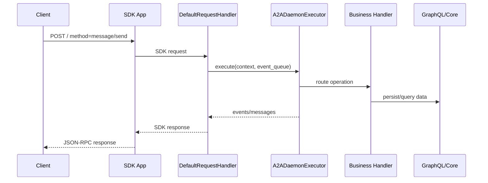
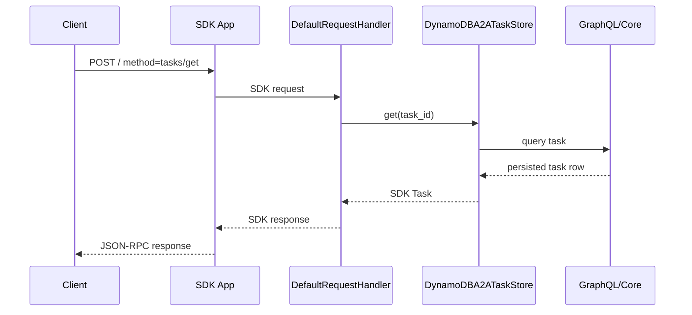
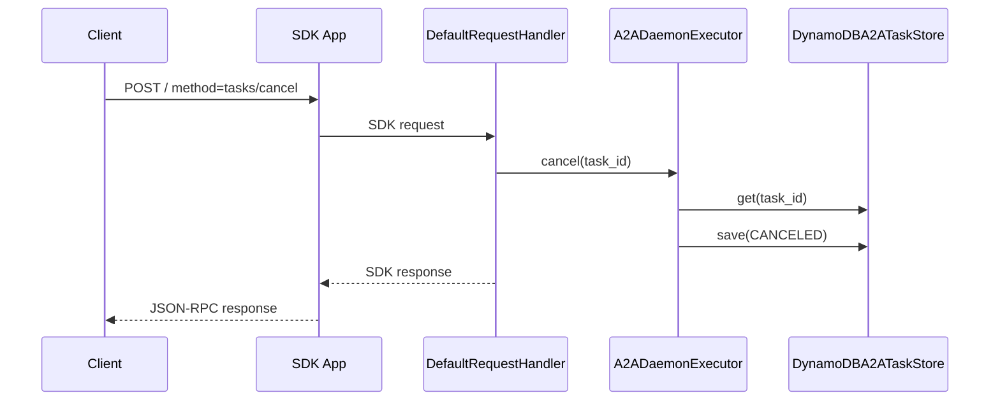

# A2A Protocol Call Flow

The SDK Starlette app exposes two HTTP JSON-RPC entry points:

- `POST /` — compatibility endpoint accepting the slash-style method names
  (`message/send`, `tasks/get`, `tasks/cancel`).
- `POST /v1` — SDK native dispatcher accepting v1 method names (`SendMessage`,
  `GetTask`, `CancelTask`); v0.3 method aliases remain enabled.

Both paths reach the same `DefaultRequestHandler` and produce identical
responses. The flows below use `POST /` for clarity; substitute `POST /v1` and
the SDK-native method name to drive the same dispatch through the native
endpoint.

Operational routes under `/rest` are not alternate protocol bindings.

## `message/send`

## `tasks/get`

## `tasks/cancel`

## Serverless JSON-RPC

`A2ADaemonEngine.a2a(**event)` accepts JSON-RPC 2.0 dictionaries only. It uses
`handlers/a2a_jsonrpc_bridge.py` to build SDK request objects and dispatches to
the same SDK request handler methods used by the HTTP path.

Non-JSON-RPC `action=...` payloads are rejected.
