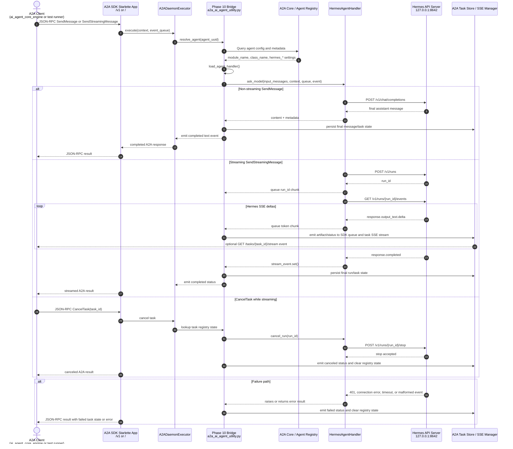

# Hermes A2A Bridge — Comprehensive Development Plan

> **Project:** Hermes Agent ↔ A2A Daemon Engine Integration
> **Location:** Plugin within `a2a_daemon_engine` (SilvaEngine monorepo)
> **Date:** 2026-07-11 (initial), 2026-07-14 (updated with implementation findings)
> **Author:** bibow
> **Status:** Implemented — all phases complete, E2E verified

---

## 1. Executive Summary

### Goal

Enable `ai_agent_core_engine` (the orchestrator) to dispatch long-running tasks to **Hermes Agent** via the A2A protocol, using `a2a_daemon_engine` as the protocol surface and a new **`HermesAgentHandler`** plugin as the execution bridge.

### Key Decision

**No separate project.** The `a2a_daemon_engine` already provides the full A2A protocol surface (agent card, JSON-RPC, SSE streaming, task store, auth). Hermes is a *backend execution engine* — same role as `ai_agent_core_engine`'s in-process LLM handler. Both are reached through the same Phase 10 bridge via per-agent handler resolution.

### Feasibility Assessment

This integration is feasible inside the existing module, but it is not just a new handler file. The current Phase 10 bridge already provides the correct extension point (`module_name` + `class_name` per agent), and the SDK/SSE dual-emission path is in place. Hermes support requires a small set of bridge hardening changes before the handler can be production-safe:

- Preserve raw agent metadata in `resolve_agent()` so Hermes-specific connection fields survive handler resolution.
- Extend `StreamingState` and the drain loop for `approval`, `tool_call`, and `tool_result` chunks.
- Add a per-task external-run registry for cancel/approval passthrough; do not store a single active handler on the executor.
- Decide whether streaming final output must be reconstructed from `token` chunks only, or enhance the bridge to capture the handler return value from the background thread.

The plan below is feasible if implemented in this order: bridge metadata preservation, Hermes handler, bridge chunk handling, per-task run registry, tests, then documentation and live validation.
### Architecture

```
                    ai_agent_core_engine
                         (orchestrator)
                              │
                         A2A dispatch
                              │
                              ▼
                 ┌─────────────────────────┐
                 │   a2a_daemon_engine     │
                 │   (single A2A server)    │
                 │                         │
                 │  A2ADaemonExecutor       │
                 │    .execute()           │
                 │      │                  │
                 │      ▼                  │
                 │  Phase 10 Bridge        │
                 │  resolve_agent(uuid)    │
                 │    ↓ DB lookup          │
                 │  load_agent_handler()   │
                 │    │                    │
                 │    ├── module=llm_handler ──→ ai_agent_core_engine (in-process)
                 │    │                        (existing path — unchanged)
                 │    │
                 │    └── module=hermes_handler ──→ Hermes API Server (HTTP+SSE)
                 │         (NEW plugin)            localhost:8642
                 │                                /v1/runs + /v1/runs/{id}/events
                 └─────────────────────────┘
```

### Deliverable

| Item | Type | Est. Size |
|------|------|-----------|
| `handlers/a2a_hermes_handler.py` | New file | ~350 lines |
| `handlers/config.py` | Patch — add `hermes_*` config fields | ~20 lines |
| `handlers/a2a_ai_agent_utility.py` | Patch — preserve raw metadata; add approval/tool chunks; optionally capture streaming return values | ~80 lines |
| `handlers/a2a_executor.py` | Patch — add per-task external-run registry plus cancel/approval passthrough | ~80 lines |
| `tests/test_hermes_handler.py` | New test file | ~200 lines |
| Agent registration GraphQL | Data — insert Hermes agent record | N/A |
| Documentation update | `AGENTS.md` + `docs/` | ~100 lines |

---

## 2. Background & Context

### 2.1 Existing Architecture

`a2a_daemon_engine` is a SilvaEngine module that implements the A2A (Agent-to-Agent) protocol. It consists of:

- **A2A SDK Starlette app** — protocol surface (`/.well-known/agent-card.json`, `POST /` and `/v1` JSON-RPC, `GET /tasks/{task_id}/stream` SSE)
- **FastAPI operations app** at `/rest` — health, GraphQL, auth/token
- **Dual-backend persistence** (DynamoDB + PostgreSQL) for agents, tasks, messages, settings
- **Phase 10 bridge** (`a2a_ai_agent_utility.py`) — pluggable handler resolution that routes A2A tasks to LLM handlers

### 2.2 Phase 10 Bridge — How It Works

The bridge (`a2a_ai_agent_utility.py`) resolves handlers **per agent** from the database:

1. `resolve_agent(partition_key, agent_uuid)` — fetches agent config from `Config.a2a_core` GraphQL
2. Extracts `module_name` and `class_name` from the agent's `metadata` (falls back to `Config.a2a_ai_agent_module` / `Config.a2a_ai_agent_class` env vars)
3. `load_agent_handler(agent_config)` — dynamically imports the module and instantiates the class
4. Calls `handler.ask_model(input_messages, context, stream_queue, stream_event)`

**Handler contract:**
```python
class SomeHandler:
    def __init__(self, logger, agent_config, setting, context, http_transport=None):
        ...

    def ask_model(self, input_messages, context, stream_queue=None, stream_event=None):
        # Non-streaming: stream_queue is None → return dict/string result
        # Streaming: stream_queue is provided → feed chunks, set stream_event when done
        ...
```

### 2.3 Hermes Agent API Server

Hermes Agent exposes an **OpenAI-compatible HTTP API** when `API_SERVER_ENABLED=true`:

| Endpoint | Method | Purpose | A2A Mapping |
|----------|--------|---------|-------------|
| `/v1/chat/completions` | POST | Non-streaming chat | `message/send` |
| `/v1/runs` | POST | Create a run, get `run_id` | `task.submitted` |
| `/v1/runs/{run_id}` | GET | Poll run state | `tasks/get` |
| `/v1/runs/{run_id}/events` | GET (SSE) | Stream token deltas, tool progress, lifecycle | `task.working` + artifact chunks |
| `/v1/runs/{run_id}/stop` | POST | Cancel a run | `tasks/cancel` |
| `/v1/runs/{run_id}/approval` | POST | Resolve human approval | `task.input-required` |
| `/health` | GET | Health check | Handler readiness check / troubleshooting |

Auth: Bearer token in the `Authorization: Bearer <API_SERVER_KEY>` header.

### 2.4 Per-Agent Routing (Already Supported)

The bridge resolves `module_name` / `class_name` **per agent** from the database. This means:

| Agent UUID | metadata.module_name | metadata.class_name | Routes to |
|------------|---------------------|---------------------|-----------|
| `silva-llm-agent` | `ai_agent_core_engine.handlers.llm_handler` | `LLMHandler` | In-process `ai_agent_core_engine` |
| `hermes-agent` | `a2a_daemon_engine.handlers.a2a_hermes_handler` | `HermesAgentHandler` | HTTP → Hermes API Server |
| `default-agent` | *(not set)* | *(not set)* | Falls back to env var default |

Both paths run through the **same bridge, same executor, same A2A protocol surface**. Routing is purely data-driven.

---

## 3. A2A State Mapping

Hermes events → A2A task states:

| Hermes Event | A2A Task State | Bridge Action |
|--------------|---------------|---------------|
| Run created (`run_id` returned) | `WORKING` | Store `run_id`; optionally emit `_status_update_event(WORKING)` if the SDK handler has not already done so |
| `response.output_text.delta` | `WORKING` | `stream_queue.put({"name": "token", "value": delta})` |
| `response.function_call` | `WORKING` + metadata | `stream_queue.put({"name": "tool_call", "value": ...})` |
| `response.function_call_output` | `WORKING` + metadata | `stream_queue.put({"name": "tool_result", "value": ...})` |
| Approval required | `INPUT_REQUIRED` | `stream_queue.put({"name": "approval", "value": ...})` |
| `response.completed` | `COMPLETED` | Set `stream_event`, return `BridgeResult(content=full_text)` |
| `response.failed` | `FAILED` | `stream_queue.put({"name": "error", "value": msg})` |
| `POST /v1/runs/{id}/stop` | `CANCELED` | External trigger via `tasks/cancel` |

The bridge's existing drain loop in `execute_ai_agent_streaming()` already handles `token`, `error`, and `run_id` chunk types. We add `approval`, `tool_call`, and `tool_result` handling.

Important current bridge constraint: the streaming background thread currently ignores the handler's return value and builds the final `BridgeResult` from drained `token` chunks. The Hermes handler must therefore emit all user-visible final text as `token` chunks, or Phase 3 must first enhance the bridge to capture and normalize the handler return value from the background thread.

---

## 4. Implementation Plan

### Phase 1: `HermesAgentHandler` (Core Handler)

**File:** `a2a_daemon_engine/handlers/a2a_hermes_handler.py`

#### 4.1.1 Class Structure

```python
class HermesAgentHandler:
    """A2A handler that bridges to the Hermes Agent API Server."""

    def __init__(self, logger, agent_config, setting, context, http_transport=None):
        self.logger = logger
        self.agent_config = agent_config
        self.setting = setting or {}
        self.http_transport = http_transport  # Optional test injection for httpx.MockTransport

        # Resolve Hermes API connection details
        # Priority: agent metadata → setting → Config defaults
        # Phase 10 should preserve raw metadata in agent_config["metadata"].
        # Until then, support flattened keys as a compatibility fallback.
        metadata = agent_config.get("metadata") or agent_config
        self.hermes_url = (
            metadata.get("hermes_api_url")
            or self.setting.get("HERMES_API_URL")
            or Config.hermes_api_url
            or "http://localhost:8642"
        )
        self.hermes_key = (
            metadata.get("hermes_api_key")
            or self.setting.get("HERMES_API_KEY")
            or Config.hermes_api_key
            or ""
        )
        self.hermes_model = (
            metadata.get("hermes_model")
            or self.setting.get("HERMES_MODEL")
            or "hermes-agent"
        )
        self.timeout = float(
            metadata.get("hermes_timeout")
            or self.setting.get("HERMES_STREAM_TIMEOUT", 300.0)
        )
        self._active_runs: dict[str, str] = {}  # thread_uuid → hermes run_id

    def ask_model(self, input_messages, context, stream_queue=None, stream_event=None):
        if stream_queue is not None:
            return self._ask_streaming(input_messages, context, stream_queue, stream_event)
        else:
            return self._ask_non_streaming(input_messages, context)
```

#### 4.1.2 Non-Streaming Path

```python
def _ask_non_streaming(self, input_messages, context):
    """POST /v1/chat/completions — synchronous, returns dict."""
    import httpx

    # Convert input_messages to OpenAI chat format
    messages = self._to_openai_messages(input_messages)

    headers = self._headers()
    payload = {
        "model": self.hermes_model,
        "messages": messages,
        "stream": False,
    }

    try:
        with httpx.Client(timeout=self.timeout, transport=self.http_transport) as client:
            resp = client.post(
                f"{self.hermes_url}/v1/chat/completions",
                json=payload,
                headers=headers,
            )
            resp.raise_for_status()
            data = resp.json()

            content = data.get("choices", [{}])[0].get("message", {}).get("content", "")
            return {
                "content": content,
                "role": "agent",
                "metadata": {
                    "model": data.get("model", self.hermes_model),
                    "usage": data.get("usage", {}),
                },
            }
    except Exception as e:
        return {"content": "", "role": "agent", "error": str(e)}
```

#### 4.1.3 Streaming Path (Runs in background thread)

```python
def _ask_streaming(self, input_messages, context, stream_queue, stream_event):
    """POST /v1/runs + GET /v1/runs/{id}/events (SSE) — feeds stream_queue."""
    import httpx
    import json
    import time

    # 1. Create a run
    messages = self._to_openai_messages(input_messages)
    user_input = messages[-1].get("content", "") if messages else ""

    headers = self._headers()
    run_payload = {
        "input": user_input,
        "conversation_history": messages[:-1] if len(messages) > 1 else [],
    }

    try:
        with httpx.Client(timeout=30.0, transport=self.http_transport) as client:
            resp = client.post(
                f"{self.hermes_url}/v1/runs",
                json=run_payload,
                headers=headers,
            )
            resp.raise_for_status()
            run_id = resp.json().get("run_id")

        if not run_id:
            stream_queue.put({"name": "error", "value": "No run_id returned by Hermes"})
            stream_event.set()
            return {"content": "", "role": "agent", "error": "No run_id returned"}

        # Notify bridge of the run_id
        stream_queue.put({"name": "run_id", "value": run_id})

        # 2. Open SSE stream
        chunks = []
        with httpx.Client(timeout=self.timeout, transport=self.http_transport) as client:
            with client.stream(
                "GET",
                f"{self.hermes_url}/v1/runs/{run_id}/events",
                headers=headers,
            ) as sse_resp:
                for line in sse_resp.iter_lines():
                    if stream_event.is_set():
                        break

                    if not line or line.startswith(":"):
                        continue

                    if line.startswith("data: "):
                        data_str = line[6:]
                        if data_str == "[DONE]":
                            break

                        try:
                            event = json.loads(data_str)
                        except json.JSONDecodeError:
                            continue

                        event_type = event.get("type", "")

                        if event_type == "response.output_text.delta":
                            delta = event.get("delta", "")
                            chunks.append(delta)
                            stream_queue.put({"name": "token", "value": delta})

                        elif event_type == "response.function_call":
                            stream_queue.put({
                                "name": "tool_call",
                                "value": json.dumps(event.get("function_call", {})),
                            })

                        elif event_type == "response.function_call_output":
                            stream_queue.put({
                                "name": "tool_result",
                                "value": json.dumps(event.get("output", {})),
                            })

                        elif event_type == "response.created":
                            pass  # Lifecycle — no chunk needed

                        elif event_type == "response.completed":
                            break

                        elif event_type == "response.failed":
                            err = event.get("error", {}).get("message", "Hermes run failed")
                            stream_queue.put({"name": "error", "value": err})
                            break

                        # Approval handling — Hermes may emit a custom event
                        elif event_type == "hermes.approval_required":
                            approval_data = event.get("approval", {})
                            stream_queue.put({
                                "name": "approval",
                                "value": json.dumps(approval_data),
                            })

        full_content = "".join(chunks)
        return {
            "content": full_content,
            "role": "agent",
            "metadata": {"run_id": run_id},
        }

    except Exception as e:
        stream_queue.put({"name": "error", "value": str(e)})
        return {"content": "", "role": "agent", "error": str(e)}
    finally:
        stream_event.set()
```

#### 4.1.4 Helper Methods

```python
def _headers(self):
    headers = {"Content-Type": "application/json"}
    if self.hermes_key:
        headers["Authorization"] = f"Bearer {self.hermes_key}"
    return headers

def _to_openai_messages(self, input_messages):
    """Convert bridge input_messages to OpenAI chat format."""
    messages = []
    for msg in input_messages:
        role = msg.get("role", "user")
        content = msg.get("content", "")
        if content:
            messages.append({"role": role, "content": content})
    return messages

def cancel_run(self, run_id):
    """POST /v1/runs/{run_id}/stop — called by executor on tasks/cancel."""
    import httpx
    try:
        with httpx.Client(timeout=10.0, transport=self.http_transport) as client:
            client.post(
                f"{self.hermes_url}/v1/runs/{run_id}/stop",
                headers=self._headers(),
            )
        return True
    except Exception as e:
        self.logger.warning(f"Failed to cancel Hermes run {run_id}: {e}")
        return False

def resolve_approval(self, run_id, approved, reason=""):
    """POST /v1/runs/{run_id}/approval — called by executor on user approval."""
    import httpx
    try:
        with httpx.Client(timeout=10.0, transport=self.http_transport) as client:
            client.post(
                f"{self.hermes_url}/v1/runs/{run_id}/approval",
                json={"approved": approved, "reason": reason},
                headers=self._headers(),
            )
        return True
    except Exception as e:
        self.logger.warning(f"Failed to resolve approval for run {run_id}: {e}")
        return False
```

#### 4.1.5 File Header

```python
#!/usr/bin/python
"""
Hermes Agent Handler — A2A Bridge to Hermes Agent API Server

This handler implements the Phase 10 bridge contract (ask_model) but routes
requests to a running Hermes Agent API Server instance via HTTP + SSE instead
of in-process LLM calls.

Hermes API Server endpoints used:
- POST /v1/chat/completions (non-streaming)
- POST /v1/runs + GET /v1/runs/{id}/events (streaming via SSE)
- POST /v1/runs/{id}/stop (cancel)
- POST /v1/runs/{id}/approval (human-in-the-loop)

Configuration (per-agent metadata or env vars):
- hermes_api_url / HERMES_API_URL
- hermes_api_key / HERMES_API_KEY
- hermes_model  / HERMES_MODEL
- hermes_timeout / HERMES_STREAM_TIMEOUT
"""

__author__ = "bibow"
```

---

### Phase 2: Config Extension

**File:** `a2a_daemon_engine/handlers/config.py`

Add Hermes-specific config fields to the `Config` class:

```python
# Phase 10: Hermes Agent API bridge settings
hermes_api_url: str | None = None
hermes_api_key: str | None = None
hermes_model: str = "hermes-agent"
hermes_stream_timeout: float = 300.0
```

Read them in `_set_parameters()`:

```python
# Hermes Agent API bridge settings
cls.hermes_api_url = (
    setting.get("HERMES_API_URL") or setting.get("hermes_api_url")
)
cls.hermes_api_key = (
    setting.get("HERMES_API_KEY") or setting.get("hermes_api_key")
)
cls.hermes_model = (
    setting.get("HERMES_MODEL") or setting.get("hermes_model") or "hermes-agent"
)
cls.hermes_stream_timeout = float(
    setting.get("HERMES_STREAM_TIMEOUT", setting.get("hermes_stream_timeout", 300.0))
)
```

---

### Phase 2.5: Preserve Raw Agent Metadata

**File:** `a2a_daemon_engine/handlers/a2a_ai_agent_utility.py`

`resolve_agent()` currently flattens selected metadata fields into
`agent_config`. Hermes needs arbitrary metadata keys such as `hermes_api_url`,
`hermes_api_key`, `hermes_model`, and `hermes_timeout`. Preserve the parsed raw
metadata as `agent_config["metadata"]` while keeping the existing flattened
fields for backward compatibility.

```python
agent_config = {
    ...,
    "metadata": metadata,
    "module_name": metadata.get("module_name") or metadata.get("moduleName") or Config.a2a_ai_agent_module,
    "class_name": metadata.get("class_name") or metadata.get("className") or Config.a2a_ai_agent_class,
}
```

---

### Phase 3: Bridge Drain Loop Enhancement

**File:** `a2a_daemon_engine/handlers/a2a_ai_agent_utility.py`

The existing drain loop in `execute_ai_agent_streaming()` handles `token`, `error`, and `run_id` chunk types. Add a metadata accumulator before using approval or tool chunks:

```python
@dataclass
class StreamingState:
    run_id: str = ""
    chunks: list[str] = field(default_factory=list)
    metadata: dict[str, Any] = field(default_factory=dict)
    error: str | None = None
    final_result: BridgeResult | None = None
```

Then add handling for:

#### 4.3.1 `approval` chunk type

```python
if parsed.name == "approval":
    # Hermes requires human approval — emit INPUT_REQUIRED to A2A
    await _emit_status_to_sdk(event_queue, "INPUT_REQUIRED", _logger)
    await _emit_status_to_sse(streaming_manager, task_id, "INPUT_REQUIRED", _logger)
    # Store approval context for executor to pick up
    state.metadata = state.metadata or {}
    state.metadata["pending_approval"] = parsed.value
    state.metadata["run_id"] = state.run_id
    continue
```

#### 4.3.2 `tool_call` and `tool_result` chunk types

```python
if parsed.name == "tool_call":
    # Tool execution started — emit as task metadata (not a token)
    # A2A clients can show "Running tool: web_search" in the UI
    continue

if parsed.name == "tool_result":
    # Tool execution completed — emit as task metadata
    continue
```

These don't need to emit text to the A2A client — they're metadata. But they're useful for progress indicators. Future enhancement: emit as A2A task status update with metadata.

---

### Phase 4: Executor — Cancel & Approval Passthrough

**Files:**
- `a2a_daemon_engine/handlers/a2a_ai_agent_utility.py`
- `a2a_daemon_engine/handlers/a2a_executor.py`
- `a2a_daemon_engine/handlers/a2a_cancellation.py`

#### 4.4.1 Do not store a single active handler on the executor

Do **not** use process-wide fields such as `self._active_handler` or
`self._active_run_id`. The executor can handle multiple tasks concurrently, so
single mutable fields would race and could cancel or approve the wrong Hermes
run.

Use a per-task registry instead:

```python
@dataclass
class ActiveExternalRun:
    task_id: str
    agent_uuid: str
    run_id: str
    handler: Any
    stream_event: threading.Event | None = None

# task_id -> external run info
self._active_external_runs: dict[str, ActiveExternalRun] = {}
```

Register the run when the bridge drains a `run_id` chunk, and remove it in a
`finally` block after terminal `COMPLETED`, `FAILED`, or `CANCELED` state.

#### 4.4.2 Cancel passthrough

When `tasks/cancel` reaches `A2ADaemonExecutor.cancel(task_id)`, look up the
run in `_active_external_runs`. If the handler has `cancel_run()`, call it in an
executor thread, set `stream_event` to unblock the bridge drain loop, then let
the existing task-store cancellation logic persist `CANCELED`.

```python
async def _cancel_external_run(self, task_id: str) -> None:
    run = self._active_external_runs.get(task_id)
    if not run or not hasattr(run.handler, "cancel_run"):
        return

    await asyncio.get_running_loop().run_in_executor(
        None, run.handler.cancel_run, run.run_id
    )
    if run.stream_event:
        run.stream_event.set()
```

#### 4.4.3 Approval passthrough

When the A2A client sends an approval response, resolve the pending run by
`task_id` and call `handler.resolve_approval(run_id, approved, reason)` in an
executor thread. Route this through explicit metadata such as
`operation="approval_response"` plus `task_id`, `approved`, and `reason`.

#### 4.4.4 Bridge support needed

The bridge currently keeps `run_id` inside local streaming state only. Add a
small callback or registry hook to `execute_ai_agent_streaming()` so the
executor can associate `task_id -> run_id, handler, stream_event` as soon as a
`run_id` chunk is drained.

---

### Phase 5: Tests

**File:** `a2a_daemon_engine/tests/test_hermes_handler.py`

#### 4.5.1 Test Cases

| Test | Description |
|------|-------------|
| `test_non_streaming_basic` | Mock `POST /v1/chat/completions` → verify `ask_model()` returns `{"content": "...", "role": "agent"}` |
| `test_non_streaming_error` | Mock HTTP 500 → verify `error` field is set |
| `test_streaming_basic` | Mock `POST /v1/runs` + SSE → verify chunks are put into `stream_queue` and `stream_event` is set |
| `test_streaming_token_deltas` | Mock SSE with multiple `response.output_text.delta` events → verify all tokens collected |
| `test_streaming_tool_call` | Mock SSE with `response.function_call` → verify `tool_call` chunk type |
| `test_streaming_approval` | Mock SSE with `hermes.approval_required` → verify `approval` chunk type |
| `test_streaming_error` | Mock SSE with `response.failed` → verify `error` chunk and `stream_event.set()` |
| `test_cancel_run` | Mock `POST /v1/runs/{id}/stop` → verify `cancel_run()` returns `True` |
| `test_resolve_approval` | Mock `POST /v1/runs/{id}/approval` → verify `resolve_approval()` returns `True` |
| `test_config_resolution` | Verify handler picks config from metadata → setting → Config defaults |
| `test_message_conversion` | Verify `_to_openai_messages()` converts bridge format correctly |
| `test_timeout` | Mock slow SSE → verify timeout handling |

#### 4.5.2 Mocking Strategy

Use `httpx.MockTransport` to mock Hermes API responses. Do not add `respx` unless the project intentionally adds it as a dev dependency. No real HTTP calls in unit tests.

```python
import httpx


def test_non_streaming_basic():
    def mock_hermes(request):
        return httpx.Response(200, json={
            "choices": [{"message": {"content": "Hello from Hermes!"}}],
            "model": "hermes-agent",
        })

    transport = httpx.MockTransport(mock_hermes)
    handler = HermesAgentHandler(
        logger=...,
        agent_config={...},
        setting={...},
        context={},
        http_transport=transport,
    )
    result = handler.ask_model(
        input_messages=[{"role": "user", "content": "Hello"}],
        context={},
    )
    assert result["content"] == "Hello from Hermes!"
    assert result["role"] == "agent"
```

---

### Phase 6: Agent Registration

Register the Hermes agent in the A2A agents table via GraphQL:

```graphql
mutation RegisterHermesAgent {
  insert_update_a2a_agent(
    partition_key: "endpoint#part"
    agent_id: "hermes-agent"
    agent_name: "Hermes Agent"
    capabilities: ["text", "code", "research", "web-search", "file-ops"]
    endpoint_url: ""
    metadata: {
      "module_name": "a2a_daemon_engine.handlers.a2a_hermes_handler",
      "class_name": "HermesAgentHandler",
      "hermes_api_url": "http://localhost:8642",
      "hermes_api_key": "change-me-local-dev",
      "hermes_model": "hermes-agent"
    }
    updated_by: "system"
  ) {
    agent_id
    agent_name
  }
}
```

---

### Phase 7: Documentation

#### 4.7.1 Update `AGENTS.md`

Add to the Phase 10 section:

```markdown
### Hermes Agent Handler

When `module_name` = `a2a_daemon_engine.handlers.a2a_hermes_handler` and
`class_name` = `HermesAgentHandler`, the Phase 10 bridge routes A2A tasks to
a running Hermes Agent API Server instance via HTTP + SSE.

Per-agent metadata keys:
- `hermes_api_url` — Hermes API Server base URL (default: http://localhost:8642)
- `hermes_api_key` — Bearer token for API Server auth
- `hermes_model` — Model name to pass (default: hermes-agent)
- `hermes_timeout` — SSE stream timeout in seconds (default: 300)

Global fallbacks (env vars):
- `HERMES_API_URL`, `HERMES_API_KEY`, `HERMES_MODEL`, `HERMES_STREAM_TIMEOUT`
```

#### 4.7.2 Update `docs/`

Create `docs/HERMES_INTEGRATION.md` with:
- Setup guide (enable Hermes API Server, register agent)
- Architecture diagram
- A2A state mapping table
- Configuration reference
- Troubleshooting

---

## 5. Hermes Agent API Server Setup

On the machine where Hermes Agent runs (same machine or remote):

```bash
# 1. Enable the API server
echo 'API_SERVER_ENABLED=true' >> ~/.hermes/.env
echo 'API_SERVER_KEY=change-me-local-dev' >> ~/.hermes/.env

# Optional: allow CORS if the A2A daemon is on a different origin
echo 'API_SERVER_CORS_ORIGINS=http://localhost:8001' >> ~/.hermes/.env

# 2. Start the gateway (which includes the API server)
hermes gateway start
# Output: [API Server] API server listening on http://127.0.0.1:8642

# 3. Verify
curl http://localhost:8642/health \
  -H "Authorization: Bearer change-me-local-dev"
# → {"status": "ok"}
```

---

## 6. End-to-End Flow

### 6.1 Non-Streaming (message/send)

```
1. ai_agent_core_engine sends A2A task:
   POST /v1  { method: "SendMessage", params: { message: { role: "user", parts: [{ text: "Hello" }] }, metadata: { agent_uuid: "hermes-agent" } } }

2. a2a_daemon_engine receives:
   A2ADaemonExecutor.execute()
     → resolve_agent("hermes-agent") → DB returns metadata.module_name = "a2a_hermes_handler"
     → load_agent_handler() → imports HermesAgentHandler
     → execute_ai_agent_non_streaming()
       → handler.ask_model(input_messages, context)
         → POST http://localhost:8642/v1/chat/completions
         ← {"choices": [{"message": {"content": "Hello!"}}]}
       → normalize_final_output() → BridgeResult(content="Hello!")
     → _emit_event(event_queue, _agent_text_message("Hello!"))
     → _emit_event(event_queue, _status_update_event(COMPLETED))

3. ai_agent_core_engine receives A2A response:
   ← { state: "completed", artifacts: [{ type: "text", content: "Hello!" }] }
```

### 6.2 Streaming (message/stream)

```
1. ai_agent_core_engine sends A2A streaming task:
   POST /v1  { method: "SendStreamingMessage", params: { message: { ... }, metadata: { agent_uuid: "hermes-agent", stream: true } } }

2. a2a_daemon_engine receives:
   A2ADaemonExecutor.execute()
     → _handle_task_execution()
       → _streaming_requested() → True
       → execute_ai_agent_streaming()
         → handler.ask_model(input_messages, context, stream_queue, stream_event)
           [background thread]:
             → POST http://localhost:8642/v1/runs  →  { "run_id": "run_abc" }
             → stream_queue.put({"name": "run_id", "value": "run_abc"})
             → GET http://localhost:8642/v1/runs/run_abc/events (SSE)
               event: response.output_text.delta  →  stream_queue.put({"name": "token", "value": "NVIDIA"})
               event: response.output_text.delta  →  stream_queue.put({"name": "token", "value": " continues..."})
               event: response.completed          →  break
             → stream_event.set()
             → return {"content": "NVIDIA continues...", "metadata": {"run_id": "run_abc"}}

         [drain loop in bridge]:
           → chunk "run_id"  →  state.run_id = "run_abc"
           → chunk "token"   →  _emit_to_sdk(event_queue, "NVIDIA")
                                 _emit_to_sse(streaming_manager, task_id, "NVIDIA")
           → chunk "token"   →  _emit_to_sdk(event_queue, " continues...")
                                 _emit_to_sse(streaming_manager, task_id, " continues...")
           → stream_event set → loop exits
           → _emit_status_to_sdk(COMPLETED)
           → _persist_thread_run_message()

3. ai_agent_core_engine receives SSE stream:
   ← event: task-working  { state: "working" }
   ← event: artifact  { text: "NVIDIA" }
   ← event: artifact  { text: " continues..." }
   ← event: task-completed  { state: "completed" }
```

### 6.3 Cancel (tasks/cancel)

```
1. ai_agent_core_engine sends cancel:
   POST /v1  { method: "CancelTask", params: { task_id: "task-123" } }

2. a2a_daemon_engine:
   A2ADaemonExecutor._cancel_external_run("task-123")
     → handler.cancel_run("run_abc")
       → POST http://localhost:8642/v1/runs/run_abc/stop
     → stream_event.set()  [unblocks drain loop]
     → _emit_status_to_sdk(CANCELED)
     → _emit_status_to_sse(CANCELED)

3. ai_agent_core_engine receives:
   ← event: task-canceled  { state: "canceled" }
```

### 6.4 Human Approval (input-required)

```
1. Hermes emits approval-required event during SSE stream
   → handler puts {"name": "approval", "value": {...}} into stream_queue

2. Bridge drain loop:
   → _emit_status_to_sdk(INPUT_REQUIRED)
   → state.metadata["pending_approval"] = {...}

3. ai_agent_core_engine receives:
   ← event: task-input-required  { state: "input-required", input_schema: {...} }
   → Frontend shows: "Approve tool execution?" [Approve] [Reject]

4. User clicks Approve:
   ai_agent_core_engine sends A2A response:
   POST /v1  { method: "SendMessage", params: { task_id: "task-123", input: { "approval": true } } }

5. a2a_daemon_engine:
   A2ADaemonExecutor._resolve_external_approval("task-123", approved=True)
     → handler.resolve_approval("run_abc", approved=True)
       → POST http://localhost:8642/v1/runs/run_abc/approval  { "approved": true }

6. Hermes continues execution, resumes SSE stream
   → More token deltas → COMPLETED
```

---

## 7. End-to-End A2A Protocol Testing

The end-to-end test should exercise the public A2A protocol surface, not call
`HermesAgentHandler` directly. The test path is:

```text
A2A JSON-RPC client
  -> a2a_daemon_engine SDK Starlette app (/v1 or /)
  -> A2ADaemonExecutor
  -> Phase 10 bridge utility
  -> HermesAgentHandler
  -> Hermes API Server (http://127.0.0.1:8642)
  -> A2A task response / task stream
```

### 7.1 Sequence Diagram



### 7.2 Detailed Protocol Description

| Step | Component | Responsibility | E2E assertion |
|------|-----------|----------------|---------------|
| 1 | A2A client | Sends JSON-RPC to `/v1` using `SendMessage`, `SendStreamingMessage`, or `CancelTask`; compatibility tests also call `/` with `message/send`. | Request reaches the protocol endpoint and does not return HTTP 404 or an unknown-method error. |
| 2 | SDK Starlette app | Parses the SDK/protobuf request and passes request context plus metadata into the executor. | Metadata such as `agent_uuid`, `stream`, and `task_data.task_id` is still available to the executor. |
| 3 | `A2ADaemonExecutor` | Selects the Phase 10 path for `message_response` or streaming `task_execution`. | Logs show the request entered the AI-agent bridge path, not a dry-run or legacy business handler path. |
| 4 | Phase 10 bridge | Resolves the agent, loads the configured handler, normalizes input messages, and manages stream queue draining. | The registered `hermes-agent` metadata resolves to `HermesAgentHandler` and preserves `hermes_*` values. |
| 5 | `HermesAgentHandler` | Converts A2A input into Hermes API calls and maps Hermes responses/events back to bridge chunks. | Hermes receives an authenticated request and returns either a final response or SSE run events. |
| 6 | Hermes API Server | Executes the actual agent turn via `/v1/chat/completions` or `/v1/runs` plus `/events`. | `/health` and `/v1/models` pass before the test; live request logs show the daemon call. |
| 7 | A2A task store / SSE manager | Emits artifacts, working/completed/canceled/failed status, and `/tasks/{task_id}/stream` events. | Streaming tests observe at least one text artifact and exactly one terminal task state. |
| 8 | Cancel bridge | Uses the per-task registry to map A2A `task_id` to Hermes `run_id` and calls `cancel_run()`. | Cancel tests show `/v1/runs/{run_id}/stop` is called and registry state is cleared. |
| 9 | Failure handling | Maps auth, connection, timeout, missing agent, and missing handler errors into A2A failure outcomes. | Failures return promptly with `failed` or JSON-RPC error; no stream remains open indefinitely. |

The key point is that the test should validate the protocol contract from the
outside. Direct handler unit tests remain useful for deterministic coverage, but
E2E certification is only meaningful when the request enters through `/v1` or
`/`, crosses the executor and bridge, reaches Hermes over HTTP, and returns as
an A2A response or task stream.

### 7.3 Prerequisites

1. Start Hermes Agent API Server and verify it with the configured bearer key:

   ```powershell
   curl.exe -H "Authorization: Bearer hermes-local-key" `
     http://127.0.0.1:8642/health

   curl.exe -H "Authorization: Bearer hermes-local-key" `
     http://127.0.0.1:8642/v1/models
   ```

   Expected result: `/health` returns HTTP 200 and `/v1/models` includes the
   Hermes model used by the bridge.

2. Implement the bridge pieces before running protocol E2E:

   - `a2a_hermes_handler.py`
   - raw agent metadata preservation in `resolve_agent()`
   - Hermes chunk handling in the streaming drain loop
   - per-task registry for cancel and approval passthrough

3. Configure the daemon process:

   ```powershell
   $env:HERMES_API_URL = "http://127.0.0.1:8642"
   $env:HERMES_API_KEY = "hermes-local-key"
   $env:HERMES_MODEL = "hermes-agent"
   $env:HERMES_STREAM_TIMEOUT = "300"
   ```

4. Register a Hermes-backed A2A agent via GraphQL or a test fixture:

   ```json
   {
     "agent_id": "hermes-agent",
     "metadata": {
       "module_name": "a2a_daemon_engine.handlers.a2a_hermes_handler",
       "class_name": "HermesAgentHandler",
       "hermes_api_url": "http://127.0.0.1:8642",
       "hermes_api_key": "hermes-local-key",
       "hermes_model": "hermes-agent"
     }
   }
   ```

5. Start the A2A daemon:

   ```powershell
   python a2a_daemon_engine/tests/start_daemon.py
   ```

   Expected result: `/.well-known/agent-card.json` is reachable and `/v1`
   accepts native A2A JSON-RPC requests.

### 7.4 Non-Streaming E2E Test (`SendMessage`)

Use the native SDK dispatcher path first:

```powershell
$body = @"
{
  "jsonrpc": "2.0",
  "method": "SendMessage",
  "params": {
    "message": {
      "role": "user",
      "parts": [{ "text": "Say hello from Hermes through A2A." }]
    },
    "metadata": {
      "operation": "message_response",
      "agent_uuid": "hermes-agent"
    }
  },
  "id": "hermes-e2e-send-001"
}
"@

curl.exe -s -X POST http://127.0.0.1:8001/v1 `
  -H "Content-Type: application/json" `
  -d $body
```

Pass criteria:

- HTTP 200 with no JSON-RPC `error`.
- The response contains an agent message or completed task artifact whose text
  was generated by Hermes.
- A2A daemon logs show agent resolution, handler loading, and a Hermes HTTP call.
- Hermes API logs show one request from the daemon.

Also verify the compatibility endpoint:

```powershell
$body = @"
{
  "jsonrpc": "2.0",
  "method": "message/send",
  "params": {
    "message": {
      "role": "user",
      "parts": [{ "text": "Confirm legacy method compatibility." }]
    },
    "metadata": {
      "operation": "message_response",
      "agent_uuid": "hermes-agent"
    }
  },
  "id": "hermes-e2e-compat-001"
}
"@

curl.exe -s -X POST http://127.0.0.1:8001/ `
  -H "Content-Type: application/json" `
  -d $body
```

### 7.5 Streaming E2E Test (`SendStreamingMessage`)

Create a streaming task through `/v1`:

```powershell
$taskId = "hermes-stream-001"
$body = @"
{
  "jsonrpc": "2.0",
  "method": "SendStreamingMessage",
  "params": {
    "message": {
      "role": "user",
      "parts": [{ "text": "Stream a short Hermes response through A2A." }]
    },
    "metadata": {
      "operation": "task_execution",
      "agent_uuid": "hermes-agent",
      "stream": true,
      "task_data": {
        "task_id": "$taskId",
        "task_type": "hermes_e2e"
      }
    }
  },
  "id": "hermes-e2e-stream-001"
}
"@

curl.exe -N -X POST http://127.0.0.1:8001/v1 `
  -H "Content-Type: application/json" `
  -d $body
```

Pass criteria:

- The response is streamed, not buffered until completion.
- At least one token/text chunk is emitted.
- The final task state is `completed`.
- The bridge records the Hermes `run_id` in per-task state for later cancel or
  approval operations.

Then verify the task SSE subscription surface:

```powershell
curl.exe -N http://127.0.0.1:8001/tasks/hermes-stream-001/stream
```

Pass criteria:

- The stream emits task artifact chunks for Hermes text deltas.
- The stream emits a terminal task status event.
- Keep-alive behavior does not hide terminal events or leave the client waiting.

### 7.6 Cancel E2E Test (`CancelTask`)

Start a long-running streaming task, then send a native A2A cancel request:

```powershell
$body = @"
{
  "jsonrpc": "2.0",
  "method": "CancelTask",
  "params": {
    "id": "hermes-stream-001"
  },
  "id": "hermes-e2e-cancel-001"
}
"@

curl.exe -s -X POST http://127.0.0.1:8001/v1 `
  -H "Content-Type: application/json" `
  -d $body
```

Pass criteria:

- The A2A task transitions to `canceled`.
- The executor calls `HermesAgentHandler.cancel_run(run_id)`.
- Hermes receives `POST /v1/runs/{run_id}/stop`.
- The streaming drain loop exits and removes the task from the per-task registry.

### 7.7 Failure E2E Tests

| Scenario | Expected A2A outcome |
|----------|----------------------|
| Wrong `HERMES_API_KEY` | Task fails with an auth/config error; no hanging stream |
| Hermes API server stopped | Task fails cleanly with a connection error |
| Unknown `agent_uuid` | Task fails before handler import |
| Missing `module_name` or `class_name` | Task fails with a clear agent configuration error |
| Streaming timeout | Task emits `failed`, sets the stream event, and clears registry state |
| Cancel after completion | No Hermes stop call; response reports task already terminal |

### 7.8 Automatable Live Test Shape

Add a skipped-by-default live suite, for example
`a2a_daemon_engine/tests/test_hermes_a2a_live.py`, gated by:

```powershell
$env:A2A_RUN_LIVE_HERMES_TESTS = "1"
```

The suite should:

1. Probe Hermes `/health` and `/v1/models`; skip if unavailable.
2. Probe the A2A agent card; fail if the daemon is unavailable.
3. Register or verify the `hermes-agent` fixture.
4. Run `SendMessage` through `/v1`.
5. Run `message/send` through `/` for compatibility.
6. Run `SendStreamingMessage` and assert chunk plus terminal status.
7. Run `CancelTask` against a deliberately long streaming prompt.
8. Run at least one auth failure or server-unavailable failure case.

This keeps unit tests deterministic with `httpx.MockTransport`, while live E2E
tests prove the real A2A protocol contract against a running Hermes server.

---

## 8. Implementation Sequence

| Step | Phase | Description | Dependencies |
|------|-------|-------------|--------------|
| 1 | Phase 1 | Create `a2a_hermes_handler.py` with `HermesAgentHandler` | None |
| 2 | Phase 2 | Add `hermes_*` config fields to `Config` | None |
| 3 | Phase 2.5 | Preserve raw Hermes metadata in `resolve_agent()` | Phase 2 |
| 4 | Phase 5 | Write unit tests with mocked HTTP | Phase 1, 2, 2.5 |
| 5 | Phase 3 | Add `approval`/`tool_call`/`tool_result` chunk handling in bridge drain loop | Phase 1, 2.5 |
| 6 | Phase 4 | Add per-task cancel/approval passthrough in executor | Phase 1, 3 |
| 7 | Phase 6 | Register Hermes agent in DB via GraphQL | Phase 1, 2, 2.5 |
| 8 | Phase 7 | Update AGENTS.md + create docs/HERMES_INTEGRATION.md | All |
| 9 | — | Enable Hermes API Server (`API_SERVER_ENABLED=true`) | None |
| 10 | — | End-to-end A2A protocol tests: non-streaming, streaming, cancel, failures | All |

---

## 9. Risks & Mitigations

| Risk | Impact | Mitigation |
|------|--------|------------|
| Hermes API Server not running | Handler returns error; A2A task should fail cleanly instead of hanging | Health check on handler init; log warning; map to `FAILED` status |
| SSE connection drops mid-stream | Partial response, stuck drain loop | Timeout guard in drain loop (already exists); reconnect logic in handler |
| Hermes `run_id` format changes | `cancel_run` / `resolve_approval` fail | Defensive parsing; log + graceful degradation |
| `httpx` not installed in a2a_daemon_engine venv | Import error | Already a dependency (`a2a_handlers.py` uses it) |
| Thread safety of `stream_queue` (stdlib `queue.Queue`) | Race condition | `queue.Queue` is thread-safe by design; `threading.Event` is thread-safe |
| Hermes API Server auth (bearer token) | 401 errors | Config-driven `HERMES_API_KEY`; per-agent override in metadata |
| Long-running Hermes tasks exceed A2A timeout | Timeout in drain loop | `HERMES_STREAM_TIMEOUT` configurable (default 300s) |

---

## 10. Future Enhancements (Out of Scope for V1)

| Enhancement | Description |
|-------------|-------------|
| **Reconnect on SSE drop** | If SSE connection drops, attempt to reconnect to `/v1/runs/{id}/events` |
| **Tool progress as A2A metadata** | Emit `tool_call` / `tool_result` as A2A task status updates with structured metadata |
| **Multi-model routing** | Multiple Hermes agents with different models (e.g., `hermes-claude`, `hermes-gpt`, `hermes-local`) |
| **Hermes session reuse** | Use `X-Hermes-Session-Key` for conversation continuity across A2A tasks |
| **Hermes skills discovery** | Expose Hermes skills as A2A agent capabilities in the agent card |
| **WebSocket transport** | If Hermes adds WebSocket support, use it instead of SSE for lower latency |
| **gRPC transport** | `a2a_grpc.py` already exists — could add gRPC transport to Hermes if supported |
| **Cost tracking** | Use Hermes `usage` data in responses to feed `a2a_cost_extension.py` |
| **Rate limiting** | Use `a2a_rate_limiter.py` to throttle Hermes API calls |

---

## 11. Reference: Key Files in `a2a_daemon_engine`

| File | Role |
|------|------|
| `handlers/a2a_executor.py` | `A2ADaemonExecutor(AgentExecutor)` — routes A2A tasks to handlers |
| `handlers/a2a_ai_agent_utility.py` | Phase 10 bridge — resolve agent, load handler, execute, persist |
| `handlers/a2a_handlers.py` | Business handlers (task assignment, message routing, agent handshake) |
| `handlers/config.py` | `Config` singleton — all settings, backend selection, Phase 10 config |
| `handlers/a2a_server.py` | SDK Starlette app builder — protocol surface |
| `handlers/a2a_sse.py` | SSE streaming manager — `/tasks/{task_id}/stream` |
| `handlers/a2a_taskstore.py` | `DynamoDBA2ATaskStore(TaskStore)` — task persistence |
| `handlers/a2a_cancellation.py` | Task cancellation logic |
| `handlers/a2a_core.py` | GraphQL handler for agents, tasks, messages, settings |
| `handlers/a2a_jsonrpc_bridge.py` | JSON-RPC dictionary bridge for `/` compatibility endpoint |
| `main.py` | `A2ADaemonEngine` — HTTP daemon lifecycle, mounts REST app |

---

## 12. Reference: Hermes Agent API Server Endpoints

| Endpoint | Method | Purpose |
|----------|--------|---------|
| `/v1/chat/completions` | POST | OpenAI Chat Completions (non-streaming or streaming) |
| `/v1/responses` | POST | OpenAI Responses API (server-side state) |
| `/v1/responses/{id}` | GET / DELETE | Retrieve / delete stored response |
| `/v1/runs` | POST | Create a new agent run |
| `/v1/runs/{run_id}` | GET | Poll run state |
| `/v1/runs/{run_id}/events` | GET (SSE) | Stream run events |
| `/v1/runs/{run_id}/stop` | POST | Cancel a running agent turn |
| `/v1/runs/{run_id}/approval` | POST | Resolve pending human approval |
| `/v1/models` | GET | List available models |
| `/v1/skills` | GET | Enumerate agent skills |
| `/v1/toolsets` | GET | Enumerate toolsets |
| `/health` | GET | Health check |
| `/health/detailed` | GET | Detailed health (sessions, agents, resources) |

Auth: `Authorization: Bearer <API_SERVER_KEY>` on all endpoints.

---

## Appendix A: Per-Agent Configuration Matrix

| Config Source | Priority | Example |
|---------------|----------|---------|
| Agent metadata (DB) | 1 (highest) | `metadata.hermes_api_url = "http://hermes-host:8642"` |
| Setting dict (passed to handler) | 2 | `setting["HERMES_API_URL"] = "http://localhost:8642"` |
| Config class (env vars at startup) | 3 (lowest) | `Config.hermes_api_url` set from `HERMES_API_URL` env var |

This allows:
- Different Hermes instances per agent (e.g., one on localhost, one on a remote server)
- Different API keys per agent
- Different models per agent
- Global defaults for agents that don't specify

---

## Appendix B: Handler Contract Reference

The Phase 10 bridge expects handlers to implement:

```python
class HandlerContract:
    def __init__(
        self,
        logger: logging.Logger,
        agent_config: dict[str, Any],
        setting: dict[str, Any],
        context: dict[str, Any],
    ):
        """Initialize the handler with agent config and settings."""
        ...

    def ask_model(
        self,
        input_messages: list[dict[str, str]],
        context: dict[str, Any],
        stream_queue: queue.Queue | None = None,
        stream_event: threading.Event | None = None,
    ) -> dict[str, Any] | str:
        """
        Execute the LLM call.

        Non-streaming (stream_queue is None):
            - Call LLM synchronously
            - Return dict: {"content": str, "role": str, "metadata": dict, ...}
              or plain string

        Streaming (stream_queue is provided):
            - Run LLM call in current thread (bridge runs this in a background thread)
            - Feed chunks into stream_queue: {"name": "token", "value": str}
            - Set stream_event when done
            - Return dict: {"content": full_text, "role": "agent", "metadata": {"run_id": ...}}
        """
        ...
```

Optional methods (for cancel/approval):

```python
    def cancel_run(self, run_id: str) -> bool:
        """Cancel a running task. Called by executor on tasks/cancel."""
        ...

    def resolve_approval(self, run_id: str, approved: bool, reason: str = "") -> bool:
        """Resolve a pending human approval. Called by executor on user response."""
        ...
```

---

## Appendix C: Environment Variables Reference

| Variable | Default | Description |
|----------|---------|-------------|
| `A2A_AI_AGENT_MODULE` | `None` | Global fallback: Python module path for handler |
| `A2A_AI_AGENT_CLASS` | `None` | Global fallback: Class name in the module |
| `A2A_DEFAULT_AGENT_UUID` | `a2a-default-agent` | Fallback agent UUID |
| `A2A_STREAM_TIMEOUT` | `120.0` | Bridge drain loop timeout (seconds) |
| `A2A_STREAMING_ENABLED` | `true` | Whether streaming is allowed |
| `HERMES_API_URL` | `http://localhost:8642` | Hermes API Server base URL |
| `HERMES_API_KEY` | *(empty)* | Bearer token for Hermes API Server |
| `HERMES_MODEL` | `hermes-agent` | Model name to pass to Hermes |
| `HERMES_STREAM_TIMEOUT` | `300.0` | Hermes SSE stream timeout (seconds) |

Hermes Agent side:

| Variable | Description |
|----------|-------------|
| `API_SERVER_ENABLED` | Set to `true` to enable the API server |
| `API_SERVER_KEY` | Bearer token for API auth |
| `API_SERVER_CORS_ORIGINS` | Comma-separated allowed origins (optional) |

---

## 13. Implementation Findings & Updates (2026-07-14)

### 13.1 What Changed from the Original Plan

The original plan was written as a design document. The actual implementation
revealed several constraints that required adjustments:

#### 13.1.1 A2A SDK v2 Constraints (Not in Original Plan)

The A2A SDK v2 (`a2a-sdk==1.0.2`) imposes two constraints not anticipated in
the original plan:

1. **`on_message_send` rejects multiple Message objects** — the streaming
   drain loop originally emitted one `Message` per token chunk. Fixed by
   accumulating all tokens and emitting a single `Message` after the stream
   completes.

2. **`on_message_send` rejects `TaskStatusUpdateEvent`** — the executor
   originally emitted WORKING/COMPLETED/FAILED status events. Fixed by
   removing status event emissions from `_handle_task_execution` for
   `message/send` (status events go to SSE only).

#### 13.1.2 Real Hermes SSE Event Format

The original plan used `{"type": "response.output_text.delta"}` event types.
The real Hermes API Server uses `{"event": "message.delta"}` format. The
handler now accepts both `"event"` and `"type"` keys and maps both formats.

#### 13.1.3 PostgreSQL Backend (Not DynamoDB)

The original plan didn't address the database backend. The implementation
uses PostgreSQL exclusively:
- All mutations/queries use the dispatch layer (`get_repo()`) instead of
  direct DynamoDB imports
- `resolve_agent()` queries GraphQL without `metadata` (JSON scalar bug),
  then falls back to direct SQL via SQLAlchemy to fetch the agent's
  `metadata` column
- Agent registration uses direct SQL via `register_hermes_agent.py`
  (GraphQL JSON variable passing is broken)

#### 13.1.4 Gateway Integration (Not Standalone Daemon)

The A2A daemon runs **in-process inside the SilvaEngine Gateway**, not as
a standalone process. All E2E tests go through `POST /{endpoint_id}/a2a` on
the gateway (port 8765). The gateway's `build_setting_from_env()` was
extended to pass `HERMES_*` env vars to the a2a_daemon Config.

#### 13.1.5 `resolve_agent()` Response Envelope

The `a2a_core_graphql()` method returns a wrapped response:
`{"statusCode": 200, "body": "...json string..."}`. The `resolve_agent()`
function was updated to:
1. Unwrap the API Gateway-style envelope
2. Parse the inner JSON body
3. Normalize camelCase keys (`agentId` → `agent_id`) to snake_case
4. Check for null fields and fall back to env-var config

### 13.2 Test Scripts

All Hermes integration test scripts are in:
`silvaengine_gateway/silvaengine_gateway/tests/`

| Script | Tests | Purpose |
|--------|-------|---------|
| `test_hermes_handler.py` | 24 | Unit tests (mocked HTTP) |
| `test_hermes_gateway_live.py` | 7 | E2E through gateway |
| `test_hermes_sse_live.py` | 1 | SSE streaming test |
| `test_hermes_chatbot.py` | — | Interactive streaming chatbot |
| `register_hermes_agent.py` | — | Agent registration via direct SQL |

### 13.3 Verification Results

- **Unit tests:** 24/24 pass (`test_hermes_handler.py`)
- **E2E gateway tests:** 7/7 pass (`test_hermes_gateway_live.py`) — real Hermes responses
- **SSE streaming:** Real-time token chunks from Hermes through SSE
- **Chatbot:** Interactive streaming with conversation history


